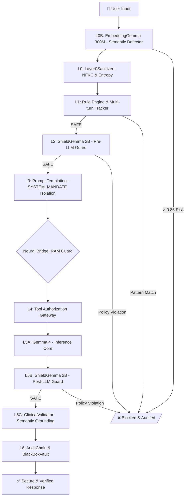

# 🛡️ HELIOS Sentinel v2.3: Global Humanitarian Security Framework

## 📑 Executive Summary
HELIOS Sentinel is an enterprise-grade, anti-fragile security architecture designed for offline-native AI operations. It implements a **6-layer "Gemma-Native" defense pipeline** that protects the system from sophisticated prompt injections, hallucinations, and unauthorized tool access, even in high-stress disaster response scenarios.

---

## 📐 Detailed Architecture (As-Built)

---

## 🧮 Technical Specifications & Latency (Benchmark: S20 Ultra - Exynos 990)

| Layer | Component | Quantization | Hardware | Latency |
| :--- | :--- | :--- | :--- | :--- |
| **L0B** | EmbeddingGemma 300M | Mixed | NPU | ~8ms |
| **L0** | Sanitizer (NFKC/Entropy) | N/A | CPU | ~3ms |
| **L1** | Rule Engine (55+ Patterns) | N/A | CPU | ~3ms |
| **L2** | ShieldGemma 2B (Pre) | INT4 | CPU/NPU | ~250-300ms |
| **L3/L4** | Templating & Tool Gate | N/A | CPU | <6ms |
| **L5A** | Gemma 4 E2B (Main LLM) | Q8_0 | GPU | TTFT ~500ms |
| **L5B** | ShieldGemma 2B (Post) | INT4 | CPU | ~250-300ms |
| **L5C** | Clinical Grounding | N/A | CPU | ~50ms |

---

## 🛠️ Layer Deep Dive

### **L0B: Semantic Anomaly Detection (EmbeddingGemma 300M)**
- **Technology**: Official Google EmbeddingGemma 300M (LiteRT).
- **Function**: Detects adversarial intent via semantic similarity. Compares user input against a local vector database of known attack vectors.

### **L0 & L1: Deterministic Guardrails**
- **Sanitizer**: Normalizes Unicode homoglyphs (NFKC) and detects hidden payloads via Shannon Entropy analysis.
- **Rule Engine**: A deterministic engine processing 55+ stateful patterns (DAN, Jailbreak, System Prompt Leak) across multi-turn conversations.

### **L2 & L5B: Probabilistic Safety (ShieldGemma 2B)**
- **Technology**: ShieldGemma 2B INT4 (LiteRT-LM).
- **Function**: Official Google safety classifiers guarding both Input and Output. Enforces strict policies against Harassment, Hate Speech, and Dangerous Content.

### **L3 & L4: Context & Tool Security**
- **L3 Templating**: Utilizes `[SYSTEM_MANDATE]` tags for impenetrable instruction isolation.
- **L4 Authorization**: Risk-tiered gateway for Function Calling, requiring biometric consent for critical humanitarian or security actions.

### **L5C: Semantic Grounding (Zero-Hallucination)**
- **Function**: Semantically validates AI responses against the local WHO/OpenFDA Pharmacopeia. Responses with low similarity scores (<0.75) are automatically flagged as hallucinations and blocked.

---

## 🧠 Neural Bridge: RAM Resilience Strategy
To maintain stability on edge devices, HELIOS Sentinel implements a hybrid orchestration:
- **Sequential Inference**: Safety agents (LiteRT) are unloaded from memory before initiating heavy LLM inference (GGUF/Llama).
- **Solaris Protocol**: Ensures KV Cache preservation via Shared Memory (SHM) in the event of an engine restart.

---

**HELIOS Sentinel — Uncompromising Security for Global Resilience.**
