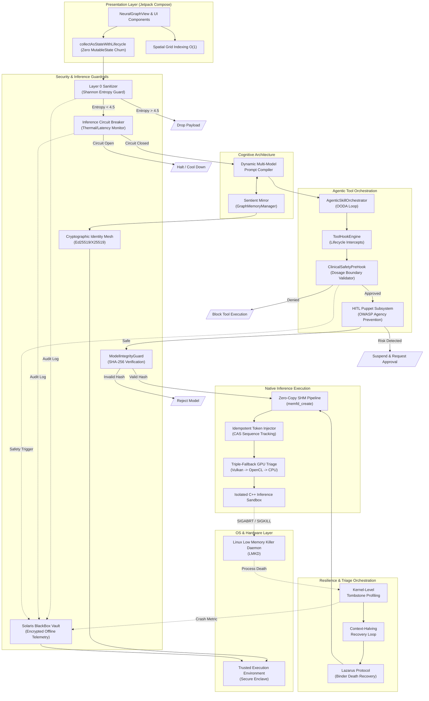

# SCYPHEON PRIVATE: ENTERPRISE ARCHITECTURE AND TECHNICAL DEEP DIVE

This document outlines the architectural topography, resilience mechanisms, and security subsystems underpinning the Scypheon Private edge intelligence platform. Engineered for zero-trust, disconnected, and resource-constrained environments, the system guarantees deterministic execution, memory safety, and uncompromising data privacy. It eschews standard mobile development patterns in favor of enterprise-grade, systems-level engineering.

---

## 1. System Architecture Diagram

The following logical topology illustrates the strict boundaries between the Presentation Layer, the Security Gateways, the Resilience Orchestration loops, and the Native Inference Core. It highlights how threats are intercepted and how catastrophic hardware failures are mitigated asynchronously.

---

## 2. Process Resilience and Memory Management

### 2.1 Zero-Copy Shared Memory (SHM) Pipeline
**Problem Domain:** Standard Android inter-process communication (IPC) via Binder enforces a strict 1MB transaction buffer limit. Streaming thousands of LLM tokens between an isolated inference process and the UI process typically causes severe memory fragmentation, Garbage Collection (GC) churn, and dropped UI frames.
**Implementation:** The architecture bypasses Binder copy limitations entirely by bridging directly to the Linux kernel via `NativeLibraryLoader.createMemfdNative`. Tensor buffers and token streams are allocated anonymously and mapped into `SharedMemory` utilizing `ParcelFileDescriptor.adoptFd()`. 
**Systemic Impact:** This allows the isolated C++ inference sandbox and the Kotlin UI process to read and write to the exact same virtual memory address space. The result is a zero-copy, zero-latency throughput pipeline capable of sustaining maximum token generation rates without impacting the UI thread's 120 FPS render budget.

### 2.2 Lazarus Protocol (Binder Death Recovery)
**Problem Domain:** Large Language Models operating on edge devices with limited RAM are highly susceptible to being killed by the Linux Low Memory Killer Daemon (LMKD) during memory pressure spikes. Standard applications crash when their underlying services are terminated.
**Implementation:** Scypheon embraces failure as a standard operational state. The `SandboxVectorEngine` implements a continuous `embedText` state-awareness loop. It actively monitors the native sandbox via `IBinder.DeathRecipient`. 
**Systemic Impact:** When the OS violently terminates the inference process (SIGKILL), the SDK traps the binder death callback. It automatically purges dangling file descriptors, cleans the shared memory references, and initiates a seamless, asynchronous cold-reboot of the sandbox. The UI remains fully responsive, masking the OS-level catastrophe from the user.

### 2.3 Context-Halving Recovery Loop
**Problem Domain:** Instantiating a massive KV-cache array during LLM initialization can trigger a rapid Out-Of-Memory (OOM) fault if the requested context window exceeds physically contiguous RAM availability.
**Implementation:** Within the `ScypheonRepository`, the triage system acts as a deterministic memory negotiator. If an integrity probe fails or a SIGABRT is caught during memory allocation for a specific context size ($N$), the initialization is caught, not crashed.
**Systemic Impact:** The system recursively attempts to re-instantiate the model by systematically halving the context window ($N/2, N/4$) until a stable memory footprint is locked in. This guarantees operational continuity and model availability, gracefully degrading capabilities rather than suffering a hard failure.

### 2.4 Idempotent Token Injector
**Problem Domain:** During a Lazarus process resurrection, restoring the exact state of the LLM requires re-injecting the conversation context. In an asynchronous, multi-threaded recovery environment, race conditions can cause tokens to be injected multiple times, leading to context corruption and hallucination.
**Implementation:** The `ContextReplayBuffer` maintains a persistent rolling window of the active context. The `IdempotentTokenInjector` governs the re-insertion of these tokens using an `AtomicLong` tracker (`lastProcessedSeq`). 
**Systemic Impact:** By comparing the incoming sequence ID against the atomic tracker via a Compare-And-Swap (CAS) paradigm, the engine guarantees exactly-once processing (idempotency). This absolutely mitigates concurrent duplicate injections, ensuring mathematical determinism during state restoration.

---

## 3. Security and Inference Guardrails

### 3.1 Shannon Entropy Guard (Layer 0 Sanitizer)
**Problem Domain:** Edge models are vulnerable to sophisticated adversarial attacks, including polymorphic shellcode injections, Base64-encoded prompt smuggling, and zero-width character manipulation designed to bypass standard regex filters.
**Implementation:** The `Layer0Sanitizer` intercepts all raw input. It first applies NFKC Unicode normalization to strip zero-width characters and homoglyphs. It then mathematically calculates the Shannon Entropy ($H(X) = -\sum p(x) \log_2 p(x)$) of the byte distribution. 
**Systemic Impact:** Natural human language maintains a predictable entropy curve. Inputs exceeding a critical entropy threshold of 4.5 are instantly classified as `EXCESSIVE_ENTROPY` (indicative of obfuscated payloads) and dropped at Layer 0, preventing the native inference engine from ever evaluating the malicious tensor block.

### 3.2 Human-in-the-Loop (HITL) Puppet Subsystem
**Problem Domain:** Autonomous background agents processing complex workflows pose a severe "Excessive Agency" risk (OWASP LLM08), where an agent might independently execute a destructive or unauthorized system action.
**Implementation:** Background orchestration is isolated within the `VitreusFlowWorker`. The subsystem monitors all generated agent action plans against a deterministic semantic risk matrix. 
**Systemic Impact:** If high-risk operations (e.g., file deletion, outbound data transfer) are drafted, the orchestrator forcibly suspends the background coroutine. It issues an `ACTION_APPROVE_PUPPET` intent to the OS, holding the execution state in stasis until explicit, manual cryptographic/UI confirmation is provided by the human operator.

### 3.3 Inference Circuit Breaker
**Problem Domain:** Continuous high-load neural inference on mobile System-on-Chips (SoCs) causes rapid thermal buildup. If left unchecked, this leads to aggressive CPU throttling, battery degradation, and eventual hardware thermal shutdown.
**Implementation:** Modeled after enterprise distributed systems (e.g., Netflix Hystrix), the `DefaultResilienceCircuitBreaker` uses a lock-free `ConcurrentHashMap` to track rolling error rates, timeout anomalies, and OS thermal API warnings.
**Systemic Impact:** Upon crossing a critical degradation threshold, the circuit breaker "trips" (opens). This acts as a global firewall, halting all inference requests immediately. By blocking further execution, it allows the SoC to shed heat and recover, preventing catastrophic system-wide kernel panics.

### 3.4 Cryptographic Identity Mesh (AES-256-GCM + TEE)
**Problem Domain:** In disaster or off-grid scenarios, peer-to-peer data exchange is highly susceptible to Man-In-The-Middle (MITM) attacks and identity spoofing without a centralized Certificate Authority (CA).
**Implementation:** The `ScypheonIdentityManager` deploys a Zero-Trust offline mesh model. It leverages the Android KeyStore API to bind cryptographic operations directly to the hardware Trusted Execution Environment (TEE) / Secure Enclave.
**Systemic Impact:** Identity is mathematically proven using Ed25519 digital signatures (Non-repudiation). Secure transmission is established via X25519 Elliptic-Curve Diffie-Hellman (ECDH) key agreement, guaranteeing Perfect Forward Secrecy. Even if a device is physically compromised, past network traffic remains mathematically unbreakable.

### 3.5 Solaris BlackBox Vault (Encrypted Offline Telemetry)
**Problem Domain:** Enterprise and mission-critical applications require extensive observability to diagnose crashes, thermal panics, and security violations. However, in disconnected or highly sensitive environments (e.g., humanitarian zones, secure enclaves), relying on cloud-based telemetry (like Firebase or Datadog) is an unacceptable data sovereignty risk.
**Implementation:** Scypheon completely disables all network-based telemetry. Instead, it utilizes the `BlackBoxVault`, an offline observability pipeline. System events, hardware tombstone metrics, and security trippings (e.g., Shannon Guard triggers) are routed into a local, AES-256 encrypted SQLite database (via Room). 
**Systemic Impact:** This guarantees absolute data privacy while retaining enterprise-grade auditability. System operators or field engineers can decrypt and review the `Audit Log` metrics locally through the `TelemetryDashboardScreen` to diagnose edge-case failures without ever transmitting a single byte over the internet.

### 3.6 Model Asset Guardian (Integrity Verification)
**Problem Domain:** Deploying AI models at the edge introduces severe supply-chain risks. An adversary could silently replace a legitimate LLM file (e.g., a `.gguf` binary) on the local disk with a poisoned or trojaned model designed to execute prompt injections or generate hallucinatory medical data.
**Implementation:** The `AssetExtractor` acts as a deterministic gatekeeper during model initialization. Before any binary is mapped into the `Zero-Copy SHM Pipeline`, the `ModelIntegrityGuard` performs a cryptographic hash validation against a hardcoded, signed manifest.
**Systemic Impact:** If the computed hash of the local binary does not perfectly match the verified signature, the model is classified as compromised and instantly rejected by the `ModelSelectionViewModel`. This ensures that the engine only executes cryptographically authentic neural networks, preventing localized model poisoning attacks.

### 3.7 Agentic Tool Orchestration & Hook Engine
**Problem Domain:** Autonomous AI agents executing function calls (tools) in the background present a volatile risk surface. Unregulated tool execution can lead to catastrophic actions (e.g., executing malformed medical dosage tools, extracting sensitive SQL data, or caught in infinite generation loops). Standard LLM architectures rely on the model itself to self-regulate, which is mathematically unprovable and unsafe.
**Implementation:** Scypheon ports enterprise-grade orchestration patterns (akin to the Claude Code framework) directly into the Android layer via the `AgenticSkillOrchestrator` and `ToolHookEngine`. This provides deterministic, deterministic lifecycle intercepts (`PreToolUse`, `PostToolUse`, `StopHook`). For example, the `ClinicalSafetyPreHook` programmatically intercepts function calls destined for medical tools; if an agent drafts a tool call with an absurd dosage (e.g., `>10000mg`) or negative patient weight, the `PreToolUse` hook issues a `Denied` state, instantly blocking execution before the tool runs.
**Systemic Impact:** This guarantees "Defense-in-Depth" for agentic actions. The LLM is stripped of final authority over tool execution. By enforcing immutable, programmatic safety boundaries via `ToolHookEngine` interception, Scypheon ensures that even if the Gemma 4 model hallucinates a dangerous function call under stress, the underlying execution environment mathematically guarantees it will never execute.

---

## 4. Subsystem Capabilities and Abstractions

### 4.1 Sentient Mirror (Graph Memory Manager)
**Problem Domain:** Traditional chat applications rely on linear, sliding-window context buffers. Once an interaction falls out of the LLM's maximum token limit, the system suffers complete amnesia regarding that data.
**Implementation:** Scypheon abandons linear logging in favor of the `GraphMemoryManager`. As the user interacts, the system runs a parallel extraction pipeline that isolates named entities, facts, and predicates, writing them to an encrypted local SQL database representing a structured Knowledge Graph.
**Systemic Impact:** This transforms the application from a stateless text generator into a persistent, evolving cognitive mirror. The engine can perform structural and semantic queries against this graph, enabling deep historical recall and complex reasoning that scales infinitely without bloating the active inference context window.

### 4.2 Dynamic Multi-Model Prompt Compiler
**Problem Domain:** The open-source model ecosystem is highly heterogeneous. Llama-3, Mistral, and Gemma each require strictly enforced, incompatible prompt architectures (e.g., `<|start_header_id|>`, `[INST]`, `<start_of_turn>`). Malformed prompts lead to severe hallucination and alignment failure.
**Implementation:** The `NeuralGateway` abstracts model-specific syntax away from the core logic. The `PromptBuilder` acts as an Abstract Syntax Tree (AST) compiler. It detects the active model's architecture signature and dynamically reconstructs the system instructions, history, and active prompt on-the-fly.
**Systemic Impact:** Furthermore, it dynamically injects `<thought>` tags and Chain-of-Thought (CoT) mandates depending on the model's capabilities. This forces the model to expose its reasoning process before answering, drastically reducing clinical hallucinations and enforcing enterprise safety alignment across disparate model families.

### 4.3 Kernel-Level Tombstone Profiling
**Problem Domain:** When an external C++ binary crashes, standard Android applications treat the failure as an opaque exception, offering no actionable path for programmatic recovery.
**Implementation:** The `ScypheonRepository` operates at the systems level. Upon sandbox failure, it actively parses the Linux `HardwareTombstone` JSON artifacts dumped in the OS `/data/tombstones/` or local file directories.
**Systemic Impact:** By programmatically reading the exact POSIX signal (e.g., SIGSEGV for segmentation fault, SIGABRT for OOM) and the specific memory pressure at the exact millisecond of death, the triage orchestrator does not guess. It uses this empirical profiling data to deterministically reconfigure the tensor memory budget for the subsequent initialization attempt.

### 4.4 Triple-Fallback GPU Triage
**Problem Domain:** Android Hardware Abstraction Layer (HAL) fragmentation is notorious. A Vulkan shader that compiles perfectly on an Adreno GPU may cause an immediate kernel panic on a Mali GPU due to driver-level bugs.
**Implementation:** The model loading sequence in `ModelSelectionViewModel` refuses to rely on the inference engine's default auto-detection. It implements a strict, sequential triage waterfall.
**Systemic Impact:** It forces a Vulkan initialization. If the driver throws a panic, the exception is caught, and the system gracefully steps down to OpenCL. If OpenCL compute capabilities are unsupported, it locks into a CPU-only execution path. This ensures absolute reliability; the intelligence platform will run regardless of the underlying silicon quality.

### 4.5 Enterprise StrictMode Enforcement
**Problem Domain:** Minor inefficiencies, such as executing a small disk read or network check on the main thread, accumulate. Under the heavy load of LLM inference, these minor blocks cause micro-stutters and Application Not Responding (ANR) flags.
**Implementation:** Adhering to a "fail-fast" engineering philosophy, `ScypheonApplication` deploys Android's `StrictMode` with aggressive `VmPolicy` and `ThreadPolicy` penalties. 
**Systemic Impact:** Any unauthorized IO operations on the main thread intentionally trigger fatal application crashes during development. This draconian standard ensures that the release build's UI thread is mathematically guaranteed to be pristine, preserving the 16ms frame budget under all conceivable load conditions.

---

## 5. Visual Physics and Orchestration

### 5.1 CompletableDeferred Cryptographic Pre-Warming
**Problem Domain:** Opening an AES-256 encrypted SQLCipher database requires PBKDF2 key derivation. This cryptographic operation is intentionally slow to prevent brute-force attacks, typically blocking thread execution for hundreds of milliseconds and freezing the startup UI.
**Implementation:** The `DatabaseReadySignal` acts as a thread-safe barrier using Kotlin's `CompletableDeferred` concurrency primitive. The database is initialized exclusively on a background IO dispatcher. 
**Systemic Impact:** During this heavy cryptographic computation, the UI layer is held behind a native Splash Screen or lightweight loading state. ViewModel queries are suspended at the barrier until the `CompletableDeferred` resolves. This eliminates JNI monitor contention and guarantees zero UI jank during the cold-boot sequence.

### 5.2 Fermat's Spiral & Golden Angle Orchestration
**Problem Domain:** Visualizing complex neural knowledge graphs traditionally relies on force-directed physics engines (e.g., Barnes-Hut algorithms). These are $O(N^2)$ complex and computationally devastating for mobile CPUs, draining battery and causing severe lag.
**Implementation:** The `GraphPhysicsEngine` discards physics simulations in favor of deterministic mathematical positioning. Node coordinates are calculated using Fermat's Spiral equations: polar angle $\theta = i \times 137.5^\circ$ (the Golden Angle) and radius $r = c \sqrt{i+1}$.
**Systemic Impact:** This mathematical precision resolves node placement in $O(1)$ time per node. It intrinsically prevents visual collision and guarantees a breathtaking, uniformly dense, and organic structure. It provides premium aesthetics without the disastrous CPU overhead of physics resolution.

### 5.3 Spatial Grid Indexing O(1)
**Problem Domain:** Detecting which node a user tapped on a scalable, pannable 2D canvas typically requires an $O(N)$ raycasting iteration through every node in the graph, breaking the 120 FPS target during interaction.
**Implementation:** The `NeuralGraphView` employs a `MutableGridSpatialIndex`. The infinite canvas is digitized into fixed-size spatial buckets using a `LongSparseArray`. 
**Systemic Impact:** When a touch event occurs, the coordinates are pushed through an inverse viewport matrix to account for zoom and pan. The resulting raw coordinate is mathematically mapped to a specific grid bucket via modulo arithmetic. This drops nearest-neighbor hit detection from $O(N)$ linear time down to $O(1)$ constant time, maintaining perfectly fluid touch responsiveness even with thousands of rendered entities.