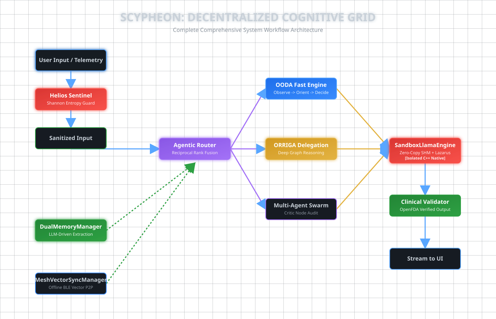

# Scypheon: Architecture Overview

Scypheon is a silicon-hardened, offline-native agentic AI platform engineered for humanitarian, medical, and disaster-response operations in edge environments.

## Visual Data Flow

Below is the high-level architecture diagram illustrating the data flow from input to safe, grounded output.

  

## Core Layers

1. **Presentation & Input Layer**: Captures user text, voice, and ambient environment data. Visualizes complex knowledge through the `NeuralGraphView` using O(1) spatial indexing and Fermat's Spiral math.
2. **Security Gateways (Helios Sentinel)**: The first line of defense. It calculates the Shannon Entropy of inputs, blocks polymorphic shellcode injections, and enforces strict operational limits.
3. **Neural Gateway**: The dynamic compiler that translates agnostic prompts into model-specific formats (Llama-3, Mistral, Gemma) and routes queries based on device capabilities.
4. **Agentic Orchestration (OODA / ORRIGA)**:
   - **OODA (Fast Path)**: Executes rapid tool calls and sensors.
   - **ORRIGA (Deep Path)**: A Directed Acyclic Graph (DAG) flow for complex factual reasoning and grounding.
   - **HITL Puppet Subsystem**: Intercepts high-risk actions (e.g., transferring funds, sending emails) and suspends execution until the user manually approves.
5. **Native Inference Core & Resilience**:
   - **Zero-Copy SHM Pipeline**: Streams thousands of LLM tokens directly between the C++ sandbox and the Kotlin UI process without memory fragmentation.
   - **Lazarus Protocol**: Monitors the C++ sandbox for OS-level kills (LMKD) and automatically resurrects the process seamlessly.
   - **GPU Triage**: Gracefully falls back from Vulkan -> OpenCL -> CPU depending on the device's hardware support.
6. **Decentralized Cognitive Memory**: 
   - **DualMemoryManager**: Uses LLM-driven fact extraction and Hybrid Time-Aware RAG (Reciprocal Rank Fusion) for long-term semantic persistence.
   - **Mesh RAG (P2P Sync)**: Bypasses cloud infrastructure entirely by synchronizing critical RAG vectors (scam signatures, medical facts) across completely offline rural communities via Bluetooth Low Energy (BLE).

---

## Technical Deep Dives
For exhaustive documentation on these systems, please refer to:
- [Technical Reference](ARCHITECTURE_TECHNICAL_REFERENCE.md) - Deep dive into code-level implementation, resilience mechanisms, and security subsystems.
- [Enterprise Whitepaper](ARCHITECTURE_ENTERPRISE_WHITEPAPER.md) - High-level strategic overview and enterprise-grade design philosophies.
