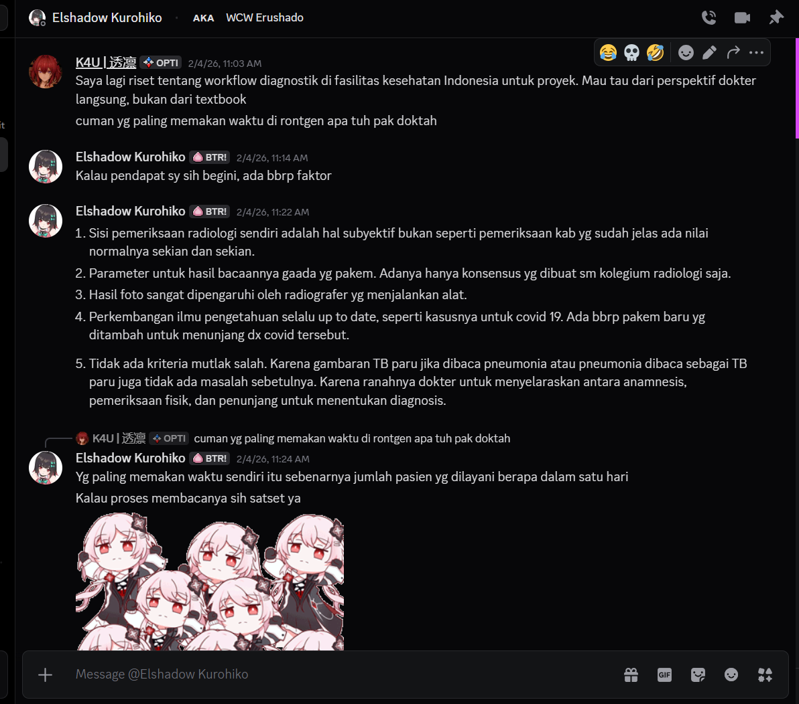
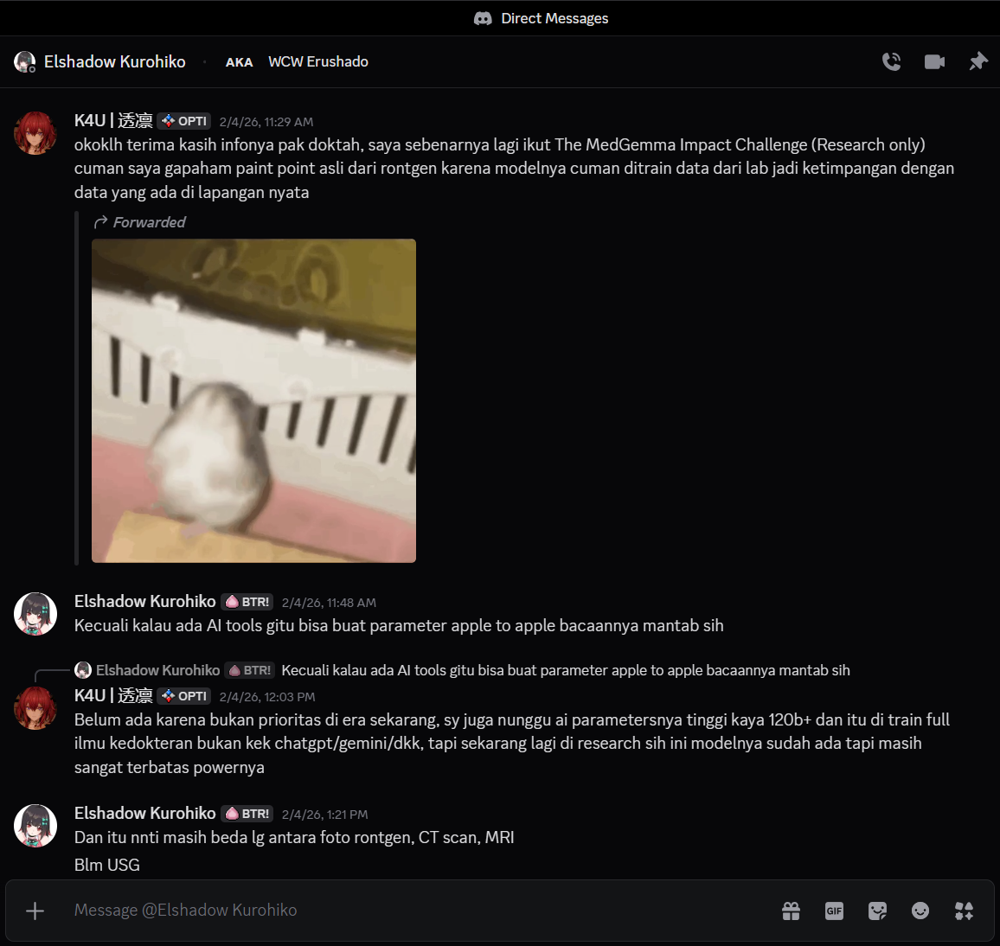
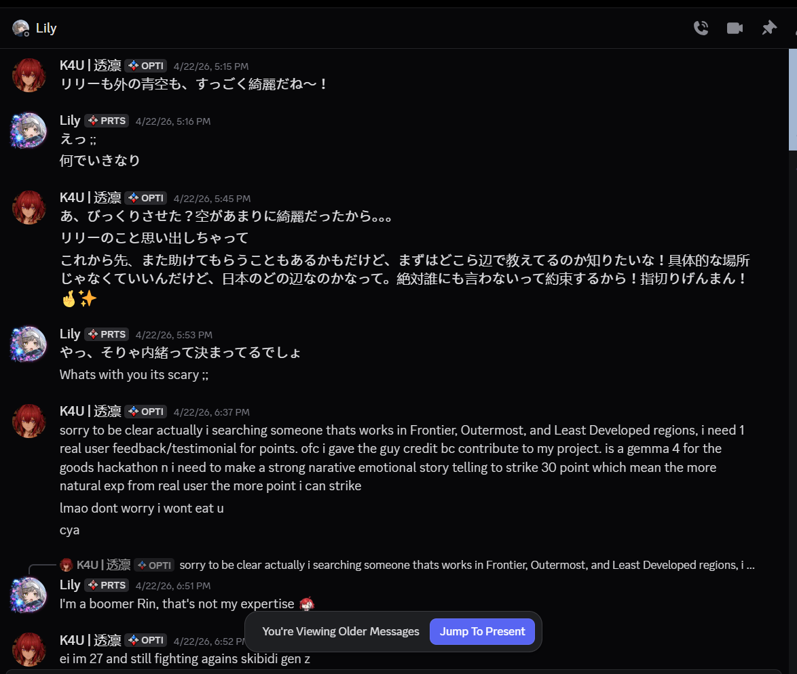

# The Scypheon Journey: Engineering a Silicon-Hardened Autonomous AI

## The Genesis: The Medical Pivot
Initially, Scypheon was envisioned as an AI assistant for radiological diagnostics (X-Ray analysis) for "The MedGemma Impact Challenge". We recognized a critical gap: AI models trained purely on controlled lab data often fail when confronted with chaotic, real-world field data.

To ground our engineering in reality, we consulted directly with practicing medical professionals to understand their exact bottlenecks.

> **Translation of the Consultation:**
> **K4U (Engineer):** I'm currently researching diagnostic workflows in Indonesian healthcare facilities for a project. I want to know from a direct doctor's perspective, not from a textbook... what consumes the most time when dealing with X-Rays, doc?
> 
> **Doctor:** In my opinion, there are several factors:
> 1. Radiological examination itself is subjective, unlike lab tests which have clear normal values.
> 2. There are no absolute parameters for reading results. There is only consensus made by the radiology collegium.
> 3. Photo results are highly influenced by the radiographer operating the machine.
> 4. Scientific development is always evolving (like COVID-19 adding new parameters).
> 5. There is no absolute wrong criteria. Because whether lung TB is read as pneumonia or vice versa isn't actually a problem. The doctor's realm is to align anamnesis, physical examination, and supporting tests to determine the diagnosis.
> 
> **K4U (Engineer):** But what consumes the most time in X-Rays?
> 
> **Doctor:** What consumes the most time is actually the sheer number of patients served in one day. The reading process itself is fast.

> **Translation of the Consultation:**
> **K4U (Engineer):** Thanks for the info doc, I'm actually participating in The MedGemma Impact Challenge (Research only), but I don't understand the real pain points of X-Rays because the models are only trained on lab data, creating a gap with real field data.
> 
> **Doctor:** Unless there's an AI tool that can create apple-to-apple parameter readings, that would be great.
> 
> **K4U (Engineer):** Not yet, because it's not a priority in this era. I'm also waiting for high-parameter AIs like 120B+ trained fully on medical science, not just general ChatGPT/Gemini, but right now it's still in research and very limited in power.
> 
> **Doctor:** And later it will still be different between X-Rays, CT scans, and MRIs. Not to mention Ultrasounds.

This conversation became our major pivot point. We realized that frontline medical workers didn't just need another generic chatbot; they needed a specialized, deterministic medical tool capable of handling the crushing volume of patients in environments where human fatigue leads to fatal errors. We began designing a system that could execute clinical validations and cross-reference symptoms autonomously.

However, as we pushed deeper into the real-world use case, the doctor we were consulting abruptly refused to elaborate further and vanished. Left without our primary medical subject matter expert, our medical diagnostic app hit a brick wall.

### The Second Pivot: Future Education and Digital Equity
Refusing to give up, we pivoted the project towards another critical frontier: **Future Education and Digital Equity**. We hypothesized that a zero-trust, offline-capable AI could serve as an interactive tutor for schools in Frontier, Outermost, and Least Developed (3T) regions, where internet access is virtually non-existent.

To validate this, I reached out to a friend in Japan, a teacher working in a rural, non-urban district, hoping to get a real user testimonial to build a strong, emotional narrative for the hackathon.

> **Translation of the Consultation:**
> **K4U (Engineer):** Lily and the blue sky outside, are both really beautiful~!
> 
> **Lily (Teacher):** Eh ;; Why so sudden
> 
> **K4U (Engineer):** Ah, did I surprise you? Because the sky was so beautiful... I remembered you. From now on, I might need your help again, but first I want to know around where you are teaching! It doesn't have to be a specific location, just around which part of Japan. I promise I absolutely won't tell anyone! Pinky swear! 🤞✨
> 
> **Lily (Teacher):** Y-yeah, that's obviously a secret, right? Whats with you its scary ;;
> 
> **K4U (Engineer):** Sorry to be clear actually I'm searching for someone that works in Frontier, Outermost, and Least Developed regions, I need 1 real user feedback/testimonial for points. Of course I will give the guy credit because they contribute to my project. It is a Gemma 4 for the Goods hackathon and I need to make a strong narrative emotional storytelling to strike 30 points which means the more natural experience from a real user the more points I can strike. Lmao don't worry I won't eat u, cya.
> 
> **Lily (Teacher):** I'm a boomer Rin, that's not my expertise 🙅🏻‍♀️
> 
> **K4U (Engineer):** ei im 27 and still fighting agains skibidi gen z

Once again, our attempt to gather real-world use-case data ended in a complete dead end. The teacher refused to elaborate further and walked away from the conversation. 

### The Third Pivot: The Community, Wangyue, and the One-Man Army

Frustrated and left with zero subject matter experts in both medicine and education, I turned to the general tech community to find a real user case. I asked them what they truly wanted from a local edge AI. Their responses were equally unhelpful and bordering on the absurd.

> **Translation of the Consultation:**
> **r_dev:** So when is the open-source AI explosion of peak performance & lightweight going to happen?
> **RyZe:** Gemma 4 32b has already surpassed OSS 120b and output quality equals Qwen 3.5 397b... But it still can't replace 5 jobs, mostly entry-level or good CS/admin jobs.
> **Tx.tsuhirx:** I want an AI that can wash my motorcycle and wash my clothes.
> **r_dev:** I want an AI equivalent to Claude Opus but it can perfectly run on 2GB of VRAM.

It became crystal clear that chasing random feature requests would only lead to bloated, impossible products. But this wasn't merely a community problem; it was a symptom of a much deeper, industry-wide sickness. 

**The Core Problem: A Toxic Industry and Fragile Ecosystems**
Watching the broader AI landscape, I saw a toxic pattern: developers were aggressively adopting a "ship fast, ship now" mentality. They bloated their applications with gimmick features to mine quick gold and secure fast venture capital, completely abandoning safety, trust, and resilience. I saw this risk threatening my own trajectory. To understand the gravity of this pivot, you must understand my background. I am an AI engineer with almost 5 years in this field. My journey started from training LoRAs and models in Stable Diffusion, evolving into a System Architect, Engineer, CEO, and full-stack founder—a true "one-man army." Over the years, I have built systems ranging from the *Open Paladin Agentic IDE* (5 months of development) to the *Vollerei Agentic ERP* (2 years of development). 

Prior to this hackathon, my primary AI endeavor was **Scypheon Agentic AI** (previously known as *Vitreon*, *Vitreus*, or *AuraLink*). Scypheon Agentic AI was built entirely differently. It was not offline-first, and it was certainly not focused on resistance. It was designed as a cloud-tethered, power-user platform conceptually akin to Gemini Intelligence. It was falling into the exact same trap as the rest of the industry: prioritizing an endless stream of features over core stability.

**The Radical Solution: The Wangyue Pivot and the ERP Standard**
At this crossroad, I looked at a game called *Wangyue* (https://wy.shiyue.com/home). When the developers faced massive criticism, instead of merely patching bugs, they executed a complete 360-degree directive pivot. I realized I needed to do the exact same thing to salvage the true potential of edge AI. 

I looked back at my work on *Vollerei*. In the world of Enterprise ERPs, failure or malfunction is strictly forbidden, no matter how disastrous the circumstances. An ERP must endure because it is the backbone of an entire organization. I decided to extract this uncompromising Enterprise standard and apply it to a completely new paradigm: **Scypheon Private**. We executed our *Wangyue* pivot. We entirely abandoned the "feature-heavy consumer app" route of Scypheon Agentic AI, spinning off Scypheon Private to drive straight into the realm of **Safety and Trust, Global Resilience, and Resistant AI**. 

**The Unprecedented Impact: Mathematical Resilience**
By applying ERP-level standards to edge intelligence, we redefined what the software could do. To me, resilience isn't just about catching an exception or showing a graceful error message. Resilience is the absolute, mathematical guarantee that the system will survive. While competitors build narrow-window edge applications that inevitably crash when the OS gets stressed or the GPU overheats, Scypheon Private was rebuilt from the ground up to withstand hardware assassination attempts and adversarial poisoning. It transformed from a generic assistant into a silicon-hardened cognitive fortress.

**The Grand Vision: Foundation Above All Else**
My vision for Scypheon Private boils down to a single principle: **"Foundation Above All Else"**. If the AI dies when the grid goes down, who can you rely on? If the app crashes and refuses to open in a life-or-death situation, what is the solution? Scypheon Private is engineered so that in the worst, most terrifying situations imaginable, the AI endures. It is not just an app; it is the pioneer edge system built on the absolute premise of survival.

## Phase 1: Core Systems Engineering (April 2, 2026 – May 5, 2026)
The foundational architecture was forged during a relentless development sprint. Deploying a 4-billion parameter LLM pipeline on an edge SoC (System-on-Chip) is a brutal war against thermodynamics, memory fragmentation, and hostile OS daemon interventions.

*   **The Vulkan Nightmare**: To achieve necessary inference throughput, we initially bound the engine to the Vulkan GPU backend. While performant on Qualcomm Adreno architectures, deploying to Exynos (Mali-G77) silicon resulted in immediate driver panics and hard kernel segmentation faults (SIGSEGV). Standard Android applications crash instantly when native bindings fault.
    *   *The Architectural Pivot*: We engineered the **Triple-Fallback GPU Triage**. If Vulkan induces a driver panic, our systems-level orchestrator traps the fault and instantly degrades the execution path to OpenCL, and subsequently to pure CPU processing.

*   **The LMKD Assassin**: Operating a massive KV-cache array on devices constrained to 6GB of RAM places the application directly in the crosshairs of the Linux Low Memory Killer Daemon (LMKD). Spikes in memory pressure caused the OS to ruthlessly assassinate the inference process.
    *   *The Architectural Pivot*: Rather than fighting the OS memory manager, we embraced deterministic failure. We isolated the C++ engine into a strict `android:isolatedProcess="true"` sandbox and bound it via `IBinder.DeathRecipient`. Thus, the **Lazarus Protocol** was born. When LMKD terminates the sandbox, the UI traps the death signal, cleans up the orphaned file descriptors, and resurrects the inference engine asynchronously in the background.

*   **The Binder Bottleneck**: Android's standard IPC (Inter-Process Communication) enforces a strict 1MB transaction buffer. Streaming thousands of token embeddings across this boundary induced severe JNI monitor contention and dropped frames.
    *   *The Architectural Pivot*: We bypassed standard Binder IPC entirely. Utilizing `NativeLibraryLoader.createMemfdNative`, we allocate anonymous Unix memory blocks and map them via `ParcelFileDescriptor.adoptFd()`. This **Zero-Copy SHM** pipeline allows the Kotlin UI process and the native C++ sandbox to share the exact same virtual memory space, yielding zero-latency $O(1)$ token rendering.

## Phase 2: Enterprise Hardening & Edge-Case Stabilization (May 6, 2026 – Present)
Following the core feature freeze on May 5, 2026, 100% of engineering bandwidth was redirected toward uncompromising system hardening and security auditing.

*   **Context Ceiling Enforcements**: We discovered that unbound context scaling triggered silent data corruption. We implemented the `MemoryGatekeeper`, introducing a hard ceiling limit of 32,768 tokens and introducing a recursive Context-Halving recovery loop down to 512 tokens to guarantee successful memory allocation during Lazarus recoveries.
*   **Startup Concurrency Resolution**: Cryptographic PBKDF2 key derivation for our AES-256 SQLCipher implementation caused main-thread blocking. We introduced the `DatabaseReadySignal` utilizing Kotlin `CompletableDeferred` primitives to strictly serialize background database decryption, ensuring a 120 FPS cold-boot sequence.
*   **Agentic Risk Interception**: To mitigate OWASP LLM08 (Excessive Agency) risks, we refined the `VitreusFlowWorker`. By promoting background processes to `FOREGROUND_SERVICE_TYPE_DATA_SYNC` and wrapping native execution in a static `aiExecutionMutex.withLock`, we eradicated kernel panics caused by parallel native LLM allocations while introducing a Human-In-The-Loop (HITL) cryptographic approval barrier for high-risk actions.

## The Result
Scypheon Private has transcended its origins as a generative text application. It is a deterministic, fault-tolerant, silicon-hardened cognitive fortress. It cannot be trivially poisoned by adversarial prompt injection, its data cannot be intercepted, and—due to its self-healing architecture—it cannot truly be killed.
