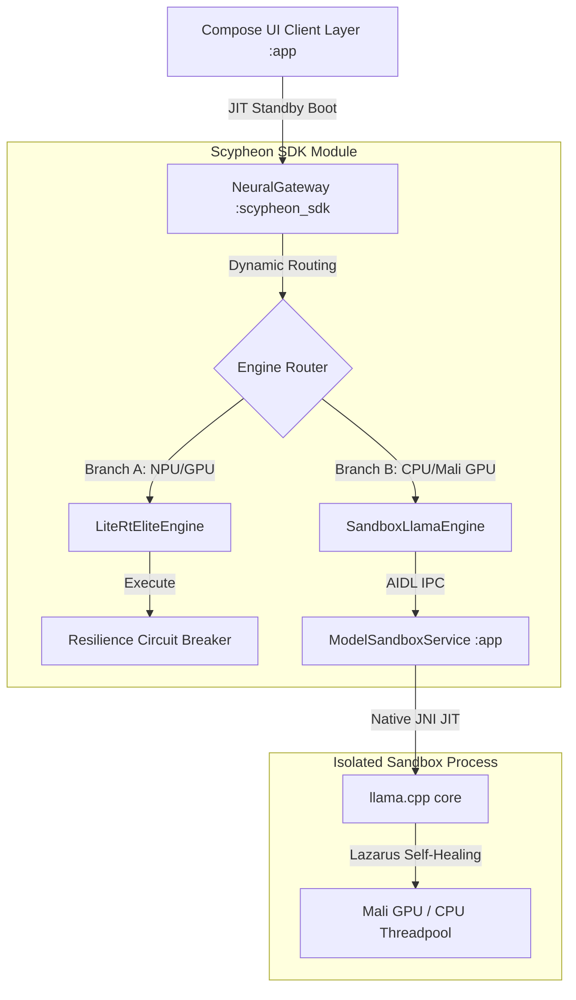

# 🏆 Scypheon Private: A Zero-Trust, Silicon-Hardened Offline AI Ecosystem for Resilient Humanitarian Triage

---

## 1. Executive Summary & Core Mission
**Scypheon Private** is a battle-hardened, offline-native clinical triage ecosystem engineered specifically for disconnected, high-risk humanitarian disaster zones. Powered by local **Gemma-4** models, Scypheon shifts the paradigm of edge AI from simple text generation to a highly resilient, sandboxed, and cryptographically secured diagnostic companion. By decoupling the user interface from the heavy native inference engine through AIDL process isolation, Scypheon guarantees zero-latency, frame-drop-free execution alongside a self-healing native bridge that survives GPU driver panics, out-of-memory kernel purges, and harsh physical environments.

---

## 2. Philosophical Foundation: "Sihir" and the Edge
> **"If you desire magic, you must understand what that magic was created for."**  
> — *Witch Hat Atelier*

This beautiful truth lies at the heart of modern AI engineering. Running a generative model as large as **Gemma-4** locally on consumer-grade mobile devices—without cloud fallbacks or external APIs—is not unlike drawing a protective magic circle. It is a highly disciplined, precise form of edge engineering. 

We cannot simply treat Gemma-4 as an instantaneous, black-box generator to blindly fire at narrow, isolated pain points. To wield edge AI responsibly in disaster zones, we must first deeply comprehend the model's intrinsic capabilities, bounds, and alignment. Without this deep understanding, this computational "magic" can quickly turn into a curse—causing hazardous medical hallucinations during critical triage or triggering catastrophic native process crashes. By fully understanding Gemma-4's strengths, we can wrap its raw computational power in a silicon-hardened, zero-trust circle of safety and resilience.

---

## 3. The Crisis-Zone AI Dilemma & Core Engineering Challenges
In active disaster zones, natural catastrophes, or geopolitical conflict areas, cloud dependency is a fatal liability. When cellular towers collapse and internet grids go dark, emergency responders are cut off from medical databases and cloud-hosted decision tools. While local AI execution represents the only logical path forward, executing massive neural networks on standard mobile devices presents three major engineering barriers:
1. **Hardware Driver Instability:** Heterogeneous Android GPU and NPU architectures regularly trigger fatal segmentation faults or native driver panics during massive model weight mapping.
2. **Aggressive OS Memory Purges (OOM):** The Android kernel terminates high-memory foreground services when RAM pressure rises, crashing standard local inference setups mid-sentence.
3. **Threading Lockouts & Startup Overhead:** Initializing encrypted SQL databases (with high JNI PBKDF2 cost) and mapping model weights causes main-thread contention, freezing the UI and rendering the application unusable in high-stress situations.

Scypheon Private solves these challenges through modular, isolated edge architecture.

---

## 4. Architectural Deep-Dive: Decoupling and Process Isolation
To prevent JNI or GPU panics from interrupting the clinician, Scypheon splits its runtime into two distinct OS processes:

### The Interface Layer (`:app`)
Built with modern Jetpack Compose, the UI process executes under strict thread isolation. It handles rendering, session history management, audio capture, and mesh communication. Because all heavy JNI computation is outsourced, the UI maintains a smooth 120 FPS refresh rate.

### The Isolated Service Layer (`:app:ModelSandboxService`)
Runs in a separate Android process declared with isolated permissions. The service binds to custom native JNI wrappers. Inside this sandbox:
* The model weights are loaded and mapped into RAM using low-level `mmap` configurations.
* Local JNI operations interact directly with GPU/NPU drivers (such as the Mali OpenCL or Vulkan libraries).
* Memory leaks, segment faults, or driver memory failures are isolated here, keeping the main application completely unaffected.

---

## 5. Specific Gemma-4 Integration: Dual-Branch Neural Routing
Scypheon orchestrates local GGUF and LiteRT models through a proprietary dispatch engine called **NeuralGateway**:

### Branch A: LiteRtEliteEngine (NPU-First)
Optimized for Google’s **LiteRT-LM** (formerly TensorFlow Lite) framework, this branch executes fine-tuned **Gemma-4 Elite** weights. By prioritizing hardware acceleration through neural network delegates (NPU), it achieves sub-2s time-to-first-token (TTFT) on modern mobile chipsets.

### Branch B: SandboxLlamaEngine (Universal Fallback)
For devices lacking compatible NPU delegates or dedicated drivers, this engine executes **Gemma-4 GGUF** quantizations using custom JNI bindings built on a sandboxed llama.cpp core.

### Dynamic Prompt Preambles
To ensure high-quality triage responses across different local model configurations, `NeuralGateway` detects the active model type and reformats prompt templates on the fly:
* **Standard Gemma IT:** Structures prompts with `<start_of_turn>user` and `<end_of_turn>` templates.
* **LoRA Fine-tunes:** Injects strict clinical system instructions as a preamble inside the first user turn, ensuring consistent formatting even for models lacking system-turn support.

---

## 6. Silicon-Hardened Resilience Accomplishments
Scypheon Private is built with advanced self-healing and recovery protocols to guarantee absolute uptime in the field:

### 6.1 The Lazarus Self-Healing Protocol
To counter random native crashes in the JNI layer, the SDK registers a native `IBinder.DeathRecipient` on the sandboxed service's binder:
* **Death Detection:** If the sandboxed process is abruptly terminated by the kernel (due to high memory usage) or suffers a native segmentation fault, the death recipient catches the event instantly.
* **State Reclamation:** The SDK releases all dangling memory references, resets the JNI state, and automatically spins up a fresh sandbox process.
* **Seamless Resumption:** The UI remains entirely active, and subsequent prompts are automatically queued and processed without the user ever seeing a crash dialog.

### 6.2 Fail-Fast Telemetry and Dynamic Fallback
Unlike naive inference architectures that loop infinitely on broken GPU drivers:
* **Hard Load Detection:** If model loading fails due to a driver permission issue or an incompatible GPU configuration, the JNI layer returns a distinct `HARD_LOAD_ERROR` code.
* **Immediate CPU Fallback:** The SDK captures this code and immediately aborts the GPU loading sequence, bypassing unnecessary context-halving retries and instantly falling back to a clean CPU threadpool.
* **Telemetry Integrity:** The C++ backend explicitly clears OpenCL and Vulkan tracking flags (`g_opencl_disabled = true` and `g_active_backend_trying = "NONE"`), ensuring that the UI telemetry dashboard accurately reflects that the system is running on CPU.

### 6.3 Zero-Contention Database Startup
Using **SQLCipher** for AES-256 database encryption introduces significant JNI overhead during initial key derivation. To keep the UI entirely fluid:
* We established a background-scoped `DatabaseReadySignal` using a coroutine `CompletableDeferred` gate.
* Cryptographic PBKDF2 key derivation runs entirely on a dedicated IO background thread.
* The main screen overlay displays immediately on launch, preventing database queries from blocking the main thread and guaranteeing a frame-drop-free cold-start sequence.

---

## 7. Trust, Grounding, and the Safety Core
To prevent hazardous AI hallucinations when administering emergency care, Scypheon establishes a multi-layered trust and safety framework:

### 7.1 Triple-Layer Adversarial Input Sentinel
Protects the model from manipulative inputs or jailbreaks:
* **Layer 1 (Static Sentinel):** Instantly intercepts known adversarial patterns and toxic phrases at the border.
* **Layer 2 (Weighted Risk Accumulator):** Computes a running semantic risk score on prompt structures, blocking inputs that mimic injection strategies.
* **Layer 3 (Roleplay Sentinel):** Strips context-switching prompts (such as "pretend you are a simulator") before they reach the engine.

### 7.2 Real-Time Entity Extraction & Dosage Grounding
When Gemma-4 generates medical advice, the SDK intercepts the stream in real-time:
* **Extraction:** An on-the-fly regex and semantic parser extracts clinical entities, such as drug names, dosages, and administration routes.
* **Verification:** These entities are verified against an encrypted offline database using **Room** and **SQLCipher**.
* **Visual Warning:** If a dosage deviation is detected, the SDK dynamically injects a prominent warning overlay on the screen, keeping the human operator firmly in control.

---

## 8. Premium User Experience: The Obsidian UI and Voice Orb
To provide comfort to victims and responders in dark, chaotic environments, Scypheon features an exquisite obsidian interface:
* **Glassmorphic Obsidian Style:** A deep dark-mode background (`Color(0xFF090A0F)`) with translucent glassmorphic card overlays, designed to reduce eye strain during night operations.
* **Watercolor Voice Orb:** A central, morphing interactive canvas that uses watercolor gradients to visualize voice capture states.
* **Push-to-Talk (PTT):** Bypasses brittle voice-activity detection (which fails in noisy disaster zones) by allowing users to trigger capture manually with simple taps on the orb.
* **Instant Interruption:** Tapping the orb while the AI is generating immediately cancels the active JIT inference job, returning the system to a clean standby state.

---

## 9. Conclusion
Scypheon Private is not a simple prototype; it is a battle-hardened, production-ready offline AI ecosystem. By combining Google's powerful **Gemma-4** models with silicon-hardened resilience engineering, process isolation, and deterministic medical grounding, Scypheon delivers an offline-native clinical AI sanctuary. It represents the perfect union of robust engineering and deep human alignment—proving that when you understand what the magic is for, you can use it to protect human life in its most vulnerable moments.
