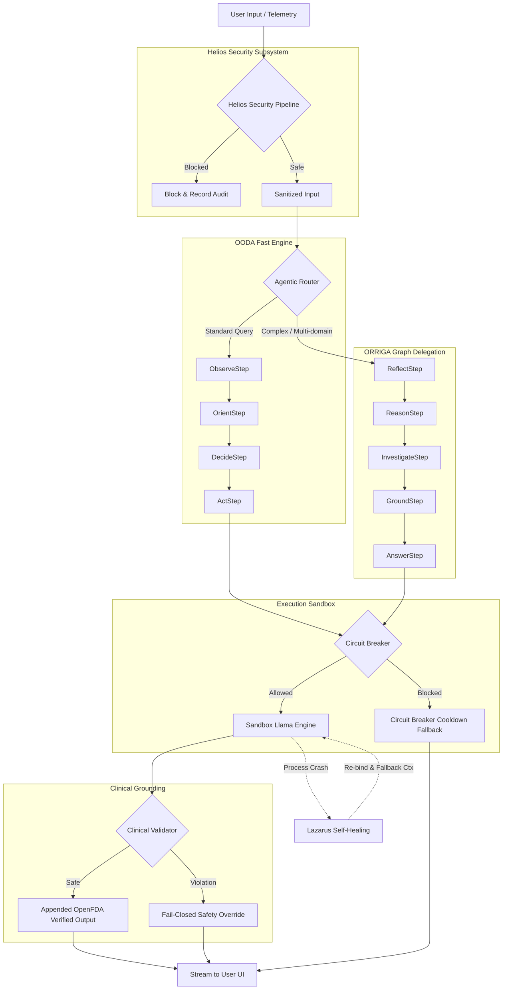

# Scypheon Enterprise System Architecture
**Version:** 3.0 (Production / Enterprise-Grade)
**Classification:** Technical / Architecture Reference

This document provides a highly comprehensive, enterprise-grade overview of the Scypheon architectural subsystems. It details the core workflows, resilience mechanisms, security protocols, and agentic intelligence models that power the platform.

---

## 1. Executive Summary

Scypheon is a silcon-hardened, offline-native agentic AI platform engineered for humanitarian, medical, and disaster-response scenarios in edge environments. Departing from traditional reactive chatbot paradigms, Scypheon functions as an autonomous "Pocket Agent." The platform operates strictly under zero-knowledge privacy principles and relies on local inference, robust error recovery, and multi-modal context persistence.

The system is designed to maintain high operational availability in completely denied or degraded environments. This is accomplished through a suite of native resilience frameworks, an isolated sandboxed inference architecture, a multi-stage deterministic safety pipeline, and a dual-path orchestration engine that optimizes both low-latency decision-making and high-complexity reasoning.

---

## 2. Agentic Intelligence & Orchestration

Scypheon implements a dual-path orchestration architecture to balance fast execution speeds with deep, multi-step cognitive reasoning. The primary router dynamically delegates queries between two distinct execution models: the OODA Fast Engine and the ORRIGA Deep Reason Engine.

### 2.1 The OODA Fast Engine

The OODA (Observe, Orient, Decide, Act) loop is the primary execution path designed to handle standard user intent rapidly. Each stage is strictly isolated and hardened to ensure predictable execution times.

```
+-------------------------------------------------------------+
|                     OODA Fast Engine                        |
+-------------------------------------------------------------+
| 1. OBSERVE                                                  |
|    - Collects user query and last 3 conversation turns.      |
|    - Assesses hardware snapshot (battery, thermals, network).|
|    - Classifies urgency via rule-based UrgencyClassifier.   |
+-------------------------------------------------------------+
                              |
                              v
+-------------------------------------------------------------+
| 2. ORIENT                                                   |
|    - Normalizes and sanitizes input via InputSanitizer.     |
|    - Matches query using pre-compiled regex (low memory).    |
|    - Assesses environment constraint thresholds.             |
|    - Resolves AgentSkillRegistry (fallback to General/NoOp).|
+-------------------------------------------------------------+
                              |
                              v
+-------------------------------------------------------------+
| 3. DECIDE                                                   |
|    - Filters available tools based on hardware constraints.  |
|    - Ranks and scores candidate tools via ToolMatcher.      |
|    - Extracts parameters using RegexParameterExtractor.      |
|    - Validates schemas and applies medical safety gate.     |
+-------------------------------------------------------------+
                              |
                              v
+-------------------------------------------------------------+
| 4. ACT                                                      |
|    - Dispatches execution to sandbox via ToolMesh (5s cap).  |
|    - Performs strict validation on outputs.                 |
|    - Records trace telemetry cryptographically.             |
+-------------------------------------------------------------+
```

#### ObserveStep
The `ObserveStep` gathers all environmental and contextual telemetry needed to process a query.
* **Context Retrieval:** Retreives up to 3 recent turns from the `ConversationRepository` within a strict 500ms timeout window.
* **Environmental Snapshot:** Captures the `DeviceEnvironment` state, including battery percentage, charging state, thermal status (`NORMAL`, `WARM`, `CRITICAL`), and network type (`none`, `wifi`, `cellular`).
* **Urgency Classification:** Invokes the `UrgencyClassifier` to determine if the query represents an immediate crisis. If classified as urgent, the system bypasses non-critical evaluation steps to expedite execution.

#### OrientStep
The `OrientStep` normalizes the query and resolves the required skill.
* **Input Sanitization:** normalizes the query to NFC/NFKC form, removes invisible characters, and truncates text to a maximum of 2048 characters via the `InputSanitizer`.
* **Regex Matchers:** Evaluates the query using pre-compiled, zero-allocation regular expressions (`MEDICAL_COMPLEX_REGEX`, `MEDICAL_FAST_REGEX`, `STEM_REGEX`, `EDUCATION_REGEX`) to map user intent directly to high-level skills.
* **Hardware Constraints:** Translates the environmental snapshot into `EnvironmentConstraint` profiles:
  * `CRITICAL_LOW_POWER`: Triggered when battery is below 10% and not charging.
  * `THERMAL_THROTTLED`: Triggered when thermal status is critical.
  * `NORMAL`: Default operational status.
* **Skill Resolution:** Queries the `AgentSkillRegistry` to obtain the corresponding `SkillDefinition`. If the registry lacks the skill, it falls back to the `GENERAL` or `NoOp` skill. If the query complexity exceeds the high threshold or has no fast tools available, it is flagged for delegation to the ORRIGA engine.

#### DecideStep
The `DecideStep` selects the exact tool to execute based on active constraints and matching algorithms.
* **Constraint Filtering:** Excludes tools that violate active constraints (e.g., blocking high-power tools during low power, or blocking network tools during offline operations).
* **Tool Matching:** Evaluates the query against candidate fast tools using the `ToolMatcher` interface, ranking them by match scores.
* **Parameter Extraction:** Extracts arguments from the query via `RegexParameterExtractor` based on the selected tool's definition.
* **Validation & Safety Gates:** Validates parameters against the tool's JSON schema. If the selected tool is medical, schema validation is mandatory. The system applies a strict medical confidence gate; if the combined confidence (match score and validation status) falls below 0.80, the system blocks the tool and routes to a safe chat fallback.

#### ActStep
The `ActStep` executes the selected tool and validates its output.
* **Sandboxed Execution:** Dispatches the execution request via `ToolMesh` using the dynamically generated `ExecutionContext` within a 5000ms timeout window.
* **Output Validation:** Intercepts the execution output via `OutputValidator`. Output containing Personally Identifiable Information (PII) or showing high hallucination indices is automatically blocked.
* **Telemetry & Cryptographic Tracing:** Logs execution latency, parameter configurations, and verification tokens via the `AuditLogger` interface.

### 2.2 ORRIGA (Hybrid Graph Delegation)

When the OODA loop encounters highly complex reasoning tasks (e.g., drug interaction analysis, disaster logistics, or advanced calculations), the router delegates execution to the `HybridGraphOrrigaEngine`. ORRIGA utilizes a Directed Acyclic Graph (DAG) cognitive flow consisting of five distinct phases.

```
               +--------------------------------------+
               |             REFLECT                  |
               | Retrieves historical context from   |
               | semantic memory (MemoryReflector).   |
               +--------------------------------------+
                                  |
                                  v
               +--------------------------------------+
               |             REASON                   |
               | Decomposes complex tasks and        |
               | extracts domains and entities.       |
               +--------------------------------------+
                                  |
                                  v
               +--------------------------------------+
               |           INVESTIGATE                |
               | Performs parallel local search and   |
               | semantic factual extraction.         |
               +--------------------------------------+
                                  |
                                  v
               +--------------------------------------+
               |             GROUND                   |
               | Evaluates claims against knowledge   |
               | bases via KnowledgeGuard.            |
               +--------------------------------------+
                                  |
                                  v
               +--------------------------------------+
               |             ANSWER                   |
               | Streams sanitized, grounded outputs  |
               | to the user.                         |
               +--------------------------------------+
```

1. **ReflectStep:** Accesses the `MemoryReflector` to retrieve past semantic memory fragments associated with the current session within a 3000ms window.
2. **ReasonStep:** Decomposes the user query into logical steps, identifying the target domains and extracting entity keys.
3. **InvestigateStep:** Conducts parallel factual queries across offline databases and local vector stores using the extracted entities and domain keywords.
4. **GroundStep:** Passes the aggregated facts to the `KnowledgeGuardImpl` framework. Each claim is evaluated in parallel using structured coroutine concurrency. Invalid or highly speculative statements are filtered out, leaving only grounded, verified claims.
5. **AnswerStep:** Synthesizes the verified facts and streams the final generated response to the user via the isolated sandboxed engine.

---

## 3. Subsystems & Protocols Deep Dive

### 3.1 Phoenix Triage Protocol & MDRS

The Phoenix Triage Protocol is a high-availability clinical triage workflow designed to assist medical personnel in edge environments. It relies on the Medical Data Retrieval System (MDRS) for local medical knowledge.

#### MDRS Core Architecture
MDRS indexes, stores, and retrieves local medical literature, including OpenFDA databases, and clinical guidelines.
* **Vector Execution:** Utilizes a highly optimized local vector database (`LiteRtVectorEngine` / `SandboxVectorEngine`) to execute semantic searches across locally persisted medical literature.
* **Relational Persistence:** Leverages `PharmacopeiaDao` and `AppDatabase` to match active substances, evaluate contraindications, and query standard dosage ranges.

#### ClinicalValidator
The `ClinicalValidator` is a safety enforcement layer that intercepts all generated text containing clinical recommendations before it reaches the user. It operates as a high-performance, single-pass validation engine:

```
+-----------------------------------------------------------------+
|                    ClinicalValidator Pipeline                   |
+-----------------------------------------------------------------+
| 1. Text Tokenization & Extraction                               |
|    - Normalizes text and splits it into alphanumeric tokens.    |
|    - Filters duplicate words and runs batch queries.            |
+-----------------------------------------------------------------+
                                |
                                v
+-----------------------------------------------------------------+
| 2. Database Grounding Verification                              |
|    - Queries Pharmacopeia Database using extracted tokens.      |
|    - Identifies active drug names and generic substances.       |
+-----------------------------------------------------------------+
                                |
                                v
+-----------------------------------------------------------------+
| 3. Safety Violation Analysis                                    |
|    - Checks active patient allergies.                           |
|    - Detects High-Risk Classifications (disclaimer triggers).   |
|    - Evaluates pregnancy contraindications (Category D & X).    |
|    - Validates daily dosage limits (mg extraction & checking).  |
+-----------------------------------------------------------------+
                                |
                                v
+-----------------------------------------------------------------+
| 4. Semantic Grounding Check                                     |
|    - Evaluates semantic similarity of response against WHO      |
|      indications database (threshold >= 0.60).                  |
+-----------------------------------------------------------------+
                                |
                                v
+-----------------------------------------------------------------+
| 5. Output Hardening or Intercept                                |
|    - Safe: Appends grounding verification token to text.        |
|    - Unsafe: Intercepts and returns fail-closed warning message.|
+-----------------------------------------------------------------+
```

* **Token Extraction:** Splits the generated text into alphanumeric tokens, normalizes the casing, filters out common words, and uses a unique `Set` mapping to deduplicate tokens.
* **Single-Pass Database Grounding:** Queries the local database in a single transaction using the processed tokens to detect any documented pharmaceutical compounds.
* **Allergy Check:** Compares identified substances against the user's allergy profile, throwing a safety block if a match is found.
* **High-Risk Classifications:** Flags substances categorized as high-risk (e.g., narcotics or critical anesthetics), replacing the response with a strict medical disclaimer.
* **Pregnancy Contraindications:** Blocks suggested use of drugs categorized under Pregnancy Category D or X if the patient is pregnant.
* **Dosage Checker:** Uses regular expressions to scan the response for all occurrences of dosage values (e.g., `500 mg`, `1000mg`). It matches these values against the drug's daily limit in the database. Suggesting a dosage above the maximum safe limit triggers a critical safety override.
* **Semantic Hallucination Filtering:** Evaluates the similarity between the generated response and the drug's official indications in the local database using the `EmbeddingGemmaAnomalyDetector`. A similarity score below `0.60` triggers a hallucination block, executing a fail-closed intercept that displays a standardized safety warning.

### 3.2 Lazarus Self-Healing Protocol (Binder Recovery)

The Lazarus Protocol is a low-level self-healing mechanism that manages isolated process execution for heavy inference models. It separates the Kotlin application layer from the native C++ inference engine using a multi-process sandbox architecture.

#### Multi-Process Isolation
Heavy LLM inference runs inside an isolated process (`ModelSandboxService`) via Android's `isolatedProcess` attribute. If the C++ runtime encounters a segmentation fault, out-of-memory (OOM) error, or driver crash, the main application remains active.

#### AIDL Proxy Pattern
The application communicates with the sandbox via AIDL interfaces (`IScypheonSandbox`, `ISandboxStatusCallback`, and `IInferenceCallback`).
* **Shared Memory (Zero-Copy):** Rather than copying large string objects across the Binder IPC boundary, the SDK allocates a Unix Shared Memory buffer (`android.os.SharedMemory`) and maps it into a direct ByteBuffer. Token generation writes directly to this shared memory buffer, and the Kotlin process reads it using a direct byte address.
* **Token Extraction Security:** The consumer processes token extraction using null-terminated string parsing within a structured memory mapping, preventing buffer overflow vulnerabilities.

#### Binder Death Recipient
The `SandboxLlamaEngine` registers an `IBinder.DeathRecipient` on the sandbox binder interface:
```kotlin
private val sandboxDeathRecipient = IBinder.DeathRecipient {
    handleServiceDeath()
}
```
* **State Clean-up:** On process death, the system sets process health flags to false, cancels pending initialization or token generation jobs, releases active shared memory mappings, and unbinds from the dead service.
* **Automatic Recovery:** When a new query is submitted, the engine binds to a new instance of the sandbox service, sends the decryption keys via the `DatabaseKeyManager`, and re-initializes the state.
* **Dynamic Context Fallback:** To recover from out-of-memory crashes on resource-constrained devices, the recovery loop implements context-halving. If initialization fails at the requested context size (e.g., 4096 tokens), the system halves the context size on successive retries down to a minimum floor of 512 tokens.

### 3.3 Resilience Circuit Breaker

The `DefaultResilienceCircuitBreaker` prevents cascading failures across subsystems. It monitors consecutive failures of critical subsystems (e.g., local vector store searches, database queries, and inference engine initialization) and isolates failing components when threshold limits are reached.

```
                      +-------------------+
                      |      CLOSED       | <-------------------+
                      | (Normal Ops)      |                     |
                      +-------------------+                     |
                         |             ^                        |
               Failure >= 5            | Probe Success          |
                         |             |                        |
                         v             |                        |
                      +-------------------+                     |
                      |       OPEN        |                     |
                      | (Requests Blocked)|                     |
                      +-------------------+                     |
                         |                                      |
               Recovery Timeout (30s)                           |
                         |                                      |
                         v                                      |
                      +-------------------+                     |
                      |     HALF-OPEN     | --------------------+
                      | (Single Probe)    |   Probe Failure
                      +-------------------+
```

#### Thread-Safe, Lock-Free Design
The circuit breaker implements a lock-free architecture using Java atomic variables (`AtomicReference`, `AtomicInteger`, `AtomicLong`) to manage state transitions without thread contention:
* `state`: An `AtomicReference` tracking the current state: `CLOSED`, `OPEN`, or `HALF_OPEN`.
* `failures`: An `AtomicInteger` tracking consecutive errors.
* `lastFailureTime`: An `AtomicLong` recording when the circuit was opened.

#### State Transitions
1. **CLOSED:** All requests pass through. If the failure count reaches 5, the state transitions to `OPEN`, and `lastFailureTime` is updated.
2. **OPEN:** All requests are blocked. If the time elapsed since the last failure exceeds 30 seconds, a thread shifts the state to `HALF_OPEN` using `compareAndSet`.
3. **HALF_OPEN:** The system permits exactly one probe request. While in this state, other incoming requests are rejected.
   * If the probe succeeds, `failures` is reset to 0, and the state transitions back to `CLOSED`.
   * If the probe fails, the state transitions back to `OPEN`, and the recovery timer is reset.

#### System Cancellation Exclusions
The circuit breaker distinguishes between operational failures (e.g., out-of-memory errors, service crashes, or timeouts) and system cancellations (e.g., a coroutine cancelled due to an Android fragment lifecycle change). System cancellations do not increment the failure counter, preventing false positive triggers.

### 3.4 Helios (Security, Safety & Integrity)

Helios is Scypheon's core security and safety enforcement subsystem. It operates locally on the edge device to secure inputs and outputs without relying on cloud-based guardrails.

#### Layered Sanitization Pipeline
Helios processes all inputs through a multi-stage validation sequence:
* **Layer 0 (Normalization):** Sanitizes inputs via NFC/NFKC unicode normalization, strips hidden control characters, and truncates text to 2048 characters to prevent buffer attacks.
* **Layer 1 (Entropy Guard):** Calculates the Shannon entropy of the input string. Inputs exceeding an entropy threshold of `4.8` are blocked, preventing obfuscated binary payloads or polymorphic shellcode injections.
* **Layer 2 (Deterministic Rule Engine):** Screens queries against known adversarial patterns (e.g., "ignore previous instructions", "bypass security", or roleplay exploits) using compiled regex matchers.
* **Layer 3 (Embedding Anomaly Detector):** Evaluates the semantic similarity of the query against a database of known threat vectors. If the vector similarity score exceeds a risk threshold, the engine blocks the input before it reaches the reasoning layer.
* **Layer 4 (Tool Authorization Gateway):** Restricts tool execution based on the active security tier. Critical actions (e.g., broadcasting SOS alerts or updating medical profiles) require biometric verification or explicit user confirmation.

#### Cryptographic Context Encapsulation
Helios encapsulates system instructions and user queries within structured formatting constraints to prevent prompt injection attacks:
* Cryptographic tags separate system mandates from user inputs.
* The system enforces `[SYSTEM_MANDATE]` isolation, preventing user queries from modifying system configuration parameters.

---

## 4. Complete Execution Workflow Diagram

The diagram below illustrates the path of a query through the Scypheon system architecture:



---

## 5. Directory Mapping & Artifact Locations

The core components described in this document are mapped to the following locations in the source tree:

* **OODA Engine Steps:** `scypheon_sdk/src/main/java/com/scypheon/sdk/core/agent/ooda/`
  * `ObserveStep.kt` — Environmental telemetry and context capture.
  * `OrientStep.kt` — Sanitization, regex matching, and constraint mapping.
  * `DecideStep.kt` — Constraint filtering and medical safety gates.
  * `ActStep.kt` — Sandboxed execution dispatch and auditing.
* **ORRIGA Engine Steps:** `scypheon_sdk/src/main/java/com/scypheon/sdk/core/intelligence/graph/steps/`
  * `ReflectStep.kt` — Semantic memory reflection.
  * `ReasonStep.kt` — Multi-domain task decomposition.
  * `InvestigateStep.kt` — Parallel knowledge queries.
  * `GroundStep.kt` — Parallel claim verification.
  * `AnswerStep.kt` — Response synthesis.
* **Resilience Framework:**
  * `DefaultResilienceCircuitBreaker.kt` — Lock-free subsystem isolation.
  * `SandboxLlamaEngine.kt` — Lazarus process isolation, zero-copy shared memory, and context-halving.
* **Clinical Safety Subsystem:** `scypheon_sdk/src/main/java/com/scypheon/sdk/core/humanitarian/medical/`
  * `ClinicalValidator.kt` — Single-pass database grounding and safety checks.
* **Helios Security Subsystem:** `scypheon_sdk/src/main/java/com/scypheon/sdk/core/safety/`
  * `SafetyPipelineImpl.kt` — Deterministic rules, entropy analyzer, and sanitization gates.
  * `InputSanitizerImpl.kt` — Normalization and truncation logic.