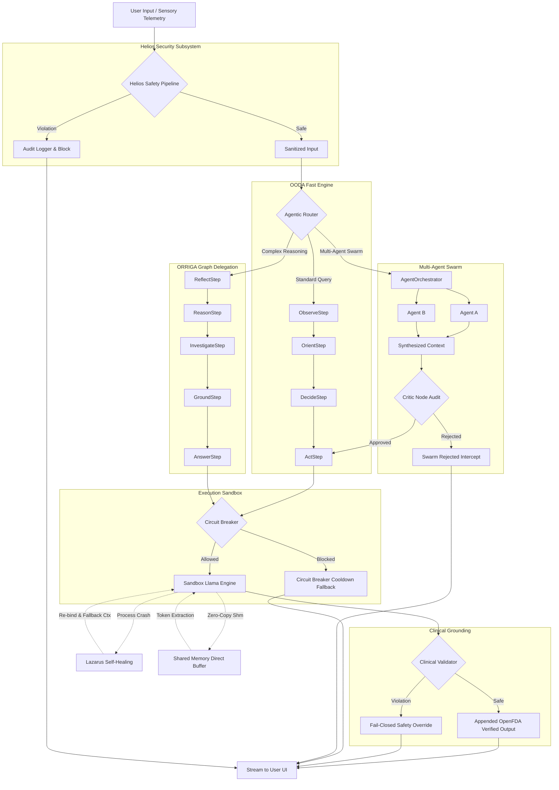

# Scypheon Enterprise System Architecture
**Version:** 6.0 (Production / Enterprise-Grade Comprehensive Reference)
**Classification:** Technical / Architecture Reference

This document provides an exhaustive, production-grade architectural analysis of the Scypheon subsystems. It details the core workflows, resilience mechanisms, security protocols, agentic intelligence models, and physical file locations that power the platform.

---

## 1. Executive Summary

Scypheon is a silicon-hardened, offline-native agentic AI platform engineered for humanitarian, medical, and disaster-response operations in edge environments. Departing from traditional reactive chatbot paradigms, Scypheon functions as an autonomous "Pocket Agent." The system operates strictly under zero-knowledge privacy principles, local inference models, robust error recovery, and P2P mesh synchronization.

To maintain high availability in completely denied or degraded environments, Scypheon integrates an isolated sandbox process inference gateway, a lock-free resilience circuit breaker, a multi-turn semantic memory graph, a real-time multimodal voice/vision pipeline, a hardware-backed cryptographic enclave, and an accessibility UI automation controller.

---

## 2. Core Routing & Inference Gateway

The entry point for all cognitive execution is the `NeuralGateway`. It acts as the primary dispatch and compilation layer for local LLM inference.

```
                  +--------------------------------+
                  |         NeuralGateway          |
                  +--------------------------------+
                                   |
                     Is LiteRT Elite Ready?
                    /                      \
                  Yes                       No
                  /                           \
                 v                             v
+-------------------------------+  +-------------------------------+
|      LiteRtEliteEngine        |  |      SandboxLlamaEngine       |
|  - Quantized Gemma-2B/4B NPU  |  |  - Sandbox Isolated Process   |
|  - Fast Intent Classification |  |  - Zero-Copy Shared Memory    |
+-------------------------------+  +-------------------------------+
                 | (Fallback)                  |
                 +-----------> [Fail] -------->+
```

### 2.1 Dual-Engine Dispatch & Fallback Cascade
The gateway coordinates two native inference engines: the lightweight `LiteRtEliteEngine` (optimized for fast CPU/NPU processing) and the heavy `SandboxLlamaEngine` (isolated GGUF model loader running in a separate sandbox process).
* **Deterministic Fallback Routing:** The gateway routes tokens using Kotlin Coroutines `Flow` streams. When a request is dispatched to `LiteRtEliteEngine`, any JNI memory failure, NPU timeout, or out-of-memory exception is caught via the `.catch` operator. The pipeline instantly triggers a cascade to the `SandboxLlamaEngine` to fulfill the prompt without disrupting the user experience.

### 2.2 Dynamic Format Compilers
The gateway dynamically compiles multi-turn chat history into model-specific token arrays based on the loaded model path:
* **Llama-3 Format:** Generates standard header structures (`<|begin_of_text|>`, `<|start_header_id|>system<|end_header_id|>`, `<|eot_id|>`).
* **Mistral Format:** Groups system and user messages inside `[INST]` wrappers.
* **Gemma Standard:** Generates standard `<start_of_turn>user\n...<end_of_turn>\n<start_of_turn>model\n` structures.
* **Gemma Unsloth LoRA Fine-tunes (Plain-Text):** fine-tuned Gemma models using Unsloth do not recognize standard system tokens and ignore separate system turns. To prevent prompt leakage or alignment bypass, the `NeuralGateway` compiles conversational turns into a unified plain-text format (`User:` and `AI:` turns) and injects system mandates directly inside the user's first query under a `### SYSTEM INSTRUCTION:` preamble.
* **ChatML (Qwen/Gemma-4 Custom):** Wraps turns in `<|im_start|>` and `<|im_end|>` delimiters.

### 2.3 JIT Model Loader Proxy Process (`ModelLoader`)
To decouple heavy GGUF file descriptor allocations from the core inference sandbox, Scypheon routes model assets through an isolated auxiliary process (`:loader`) managed by the `ModelLoader` service connection:
* **AIDL IPC Interface:** The `ModelLoader` class binds to `ModelLoaderService` via an AIDL interface `IModelLoader` under the `Context.BIND_AUTO_CREATE` flag. It provides robust model file descriptor (`ParcelFileDescriptor`) allocation, allowing high-performance, JIT zero-latency model loading or purging on-demand.
* **Resident Memory Governance:** Users can configure `isEnabled` to instantly invoke `purge()`, wiping the resident model files from high-speed memory and immediately releasing target system RAM when the application transitions to standby.

---

## 3. Agentic OODA & ORRIGA Orchestration

Scypheon utilizes a dual-path orchestration architecture to balance fast response times with deep cognitive reasoning.

```
                              User Query
                                  |
                           [Neural Gateway]
                                  |
                      Requires Deep Reasoning?
                     /                        \
                   Yes                         No
                   /                             \
                  v                               v
       +--------------------+           +--------------------+
       |  ORRIGA Deep Path  |           |   OODA Fast Path   |
       +--------------------+           +--------------------+
       | 1. REFLECT (Memory)|           | 1. OBSERVE (Turn)  |
       | 2. REASON (Split)  |           | 2. ORIENT (Sanit)  |
       | 3. INVESTIGATE     |           | 3. DECIDE (Tool)   |
       | 4. GROUND (Check)  |           | 4. ACT (Execute)   |
       | 5. ANSWER (Stream) |           +--------------------+
       +--------------------+
```

### 3.1 The OODA Fast Engine
The OODA loop intercepts standard queries to execute lightweight tool invocations rapidly.

* **ObserveStep:** Gathers up to 3 recent conversation turns from `ConversationRepository` within a strict 500ms timeout window. It evaluates `DeviceEnvironment` telemetry (battery level, charging status, network type, and thermal levels) and classifies query urgency.
* **OrientStep:** Truncates inputs to 2048 characters and normalizes the query via `InputSanitizer`. It performs intent classification using precompiled, zero-allocation regex pattern matchers (`MEDICAL_COMPLEX_REGEX`, `MEDICAL_FAST_REGEX`, `STEM_REGEX`, `EDUCATION_REGEX`) to map queries to available skills, assessing active hardware power and thermal constraints.
* **DecideStep:** Excludes tools that violate active constraints (e.g. blocking power-intensive tools during critical low battery). It ranks available fast tools using the `ToolMatcher` and extracts parameters via `RegexParameterExtractor`. The extracted arguments are verified against JSON schemas; if a medical tool's combined confidence falls below `0.80`, it is blocked and falls back to a safe conversational response.
* **ActStep:** Dispatches the tool call to the sandbox via the `Tool Mesh` framework, enforcing a 5000ms timeout window. It validates output via `OutputValidator` and logs execution telemetry cryptographically using the `AuditLogger`.

### 3.2 The ORRIGA Deep Reason Engine
When queries require deep reasoning, the router delegates execution to the `HybridGraphOrrigaEngine`, executing a Directed Acyclic Graph (DAG) cognitive flow:
* **ReflectStep:** Accesses the `MemoryReflector` to retrieve past semantic memory fragments associated with the current session within a 3000ms window.
* **ReasonStep:** Decomposes the user query into logical steps, identifying the target domains and extracting entity keys.
* **InvestigateStep:** Conducts parallel factual queries across offline databases and local vector stores using the extracted entities and domain keywords.
* **GroundStep:** Passes the aggregated facts to the `KnowledgeGuardImpl` framework. Each claim is evaluated in parallel using structured coroutine concurrency. Invalid or highly speculative statements are filtered out, leaving only grounded, verified claims.
* **AnswerStep:** Synthesizes the verified facts and streams the final generated response to the user via the isolated sandboxed engine.

---

## 4. Multi-Agent Swarm Orchestrator & Critic Node

For complex, multi-variable tasks requiring cooperative agents, Scypheon initiates the `AgentOrchestrator`.

```
                    Complex Swarm Request
                              |
                     [AgentOrchestrator]
                              |
               +--------------+--------------+
               |                             |
               v                             v
        [Agent Node A]                [Agent Node B]
       (executeTask)                 (executeTask)
               |                             |
         Max 300 Chars                 Max 300 Chars
               |                             |
               +--------------+--------------+
                              |
                              v
                   Synthesize Agent Reports
                              |
                      Create Draft Reply
                              |
                     [Critic Audit Node]
                    /                   \
               Approved               Rejected
                 /                         \
                v                           v
         Stream Draft Response      [REJECTED] Flag Intercept
```

* **RAM Optimization via Lazy Loading:** To prevent memory bloat during parallel swarm initialization, the orchestrator leverages Lazy injection properties (`Lazy<NeuralGateway>`, `Lazy<SafetyOrchestrator>`). Components are loaded into RAM only when the swarm execution begins.
* **Context Explosion Protection:** To prevent context limit exhaustion when multiple agents run in parallel, the orchestrator truncates each agent's output to a maximum of 300 characters before synthesis.
* **Critic Self-Reflection Audit:** Once the commander agent synthesizes the draft response, the orchestrator routes it to a dedicated **Critic Node** for self-reflection. The Critic audits the draft specifically for medical hallucinations or safety violations, responding with either `[APPROVED]` or `[REJECTED] <reason>`. If rejected, the orchestrator intercepts the output, blocks the draft, and returns a structured safety warning.

---

## 5. Multimodal Live Mode Subsystem

The `LiveSessionOrchestrator` implements a continuous voice-to-voice and vision-to-voice interaction pipeline.

```
[ContinuousSpeechRecognizer] -> [STT] -> user text 
                                           |
[LiveVisionPipeline (CameraX)] -> Bitmap -> [LiveSessionOrchestrator] -> Gemma 4 -> tokens
                                           |                                          |
[Ambient Noise Classifier] ----> Context ->+                                          v
                                                                                [TTS Audio Stream]
                                                                                      |
                                                                                [Auto-Listen]
```

* **Real-time State Machine:** The orchestrator maintains six conversational states to manage natural turn-taking:
  * `Idle`: Initial inactive state.
  * `Listening`: Actively recording user audio.
  * `UserSpeaking`: User voice detected, streaming real-time STT fragments.
  * `Processing`: Generating tokens through local inference.
  * `AiSpeaking`: AI response streaming via TTS audio blocks.
  * `Error`: Catching device, microphone, or safety pipeline failures.
* **Proactive Multimodal Awareness:** Ingests direct CameraX frames (`injectCameraFrame`) as Bitmap caches and analyzes environmental audio (`injectAmbientContext`). These are injected into the LLM history using custom tags (e.g., `[VISION CONTEXT: ...]` and `[AMBIENT: ...]`). The system prompt instructs the model to proactively comment on dangerous or interesting sights in edge environments.
* **Acoustic Level Feedback:** Normalizes incoming microphone RMS dB values into a continuous float scale (0.0 to 1.0) to drive a watercolor waveform visualization on the interface.
* **Context Overrun Prevention:** Continuously prunes conversation history. It preserves active system instructions while maintaining only the last 20 conversation turns, avoiding performance degradation during extended sessions.

---

## 6. HITL (Human-in-the-Loop) Puppet Subsystem

Within the `:app` client codebase, Scypheon enforces strict security boundaries on background agent swarm execution via the Human-in-the-Loop (HITL) Puppet Subsystem.

```
                  [VitreusFlowWorker] Background Run
                               |
                    Acquire Local LLM Mutex
                               |
                  Run AgentOrchestrator Swarm
                               |
                  Scans Output for Risk Keywords
                 (send, transfer, delete, pay etc.)
                               |
                     Risk Detected?
                    /              \
                  Yes               No
                  /                   \
                 v                     v
     [Suspend & Raise HITL Alert]   [Save Success]
  - DB Status: [STATUS_SYSTEM]
  - Text: [AWAITING_APPROVAL]
  - Issue Broadcast Notification
                 |
      User Clicks "APPROVE"
                 |
      [PuppetApprovalReceiver]
  - DB Status: [STATUS_SUCCESS]
  - Text: [USER_APPROVED]
  - Cancel Notification ID 1338
```

### 6.1 Background Swarm Execution (`VitreusFlowWorker`)
The background execution framework is managed by `VitreusFlowWorker`, implementing the following protocols:
* **Foreground Service Promotion:** To evade Android's standard 10-minute OS task execution timeouts, the worker promotes itself to a Foreground service using `ForegroundInfo` configured under the `ServiceInfo.FOREGROUND_SERVICE_TYPE_DATA_SYNC` type (SDK 29+).
* **JNI Kernel Panic Mitigation (LLM Mutex Serialization):** Running parallel native allocations can cause Mali graphics driver segmentation faults or kernel out-of-memory terminations. To secure the device's stability, all background inference tasks strictly serialize executions using a global static Kotlin `Mutex` block (`aiExecutionMutex.withLock`).
* **Database TTL Sweep:** Cleans and prunes local SQLite datasets periodically. It executes a database Time-To-Live sweep that deletes historical conversation log records older than 30 days and expires zombie suspended approval tasks older than 15 minutes.
* **Context-Aware Swarm Queries:** Aggregates recent conversation turns from `DualMemoryManager` (collecting up to 5 context-eligible successful messages from the last 3 sessions), dynamically compiles a comprehensive analysis prompt, and dispatches it to the `AgentOrchestrator` swarm.

### 6.2 High-Risk Interception & Human Approval
* **Keyword Risk Scanner:** Once the swarm generates the report, the worker parses the output for high-risk action keywords (`send`, `transfer`, `gmail`, `delete`, `remove`, `format`, `pay`).
* **Suspended Approval Insertion:** If a match is triggered, the worker blocks the output, formats it under the `[AWAITING_APPROVAL]` tag, and persists the payload with status `STATUS_SYSTEM`. It then issues a high-priority system alarm notification with an interactive **APPROVE** action.
* **Broadcast Authorization (`PuppetApprovalReceiver`):** When the user approves the action, the `PuppetApprovalReceiver` intercepts the `"com.scypheon.app.ACTION_APPROVE_PUPPET"` intent. It updates the database repository, transition-logging the message status to `STATUS_SUCCESS` under the `[USER_APPROVED]` header, and cancels active notification ID `1338`, allowing the background worker process to complete with verified operator consent.

---

## 7. Security, Privacy & Zero-Knowledge Enclave

Scypheon is designed to operate securely even if the hosting hardware is lost, compromised, or stolen in a crisis zone.

### 7.1 Hardware-Backed Cryptographic Enclave
The `ZeroKnowledgeEnclave` implements hardware-backed cryptography to secure chat logs, RAG indices, and medical telemetry data:
* **Key Generation:** Generates a 256-bit AES symmetric key in the secure `AndroidKeyStore`, configuring GCM block modes and disabling padding (`AES/GCM/NoPadding`).
* **Encryption Schema:** Plaintext data is encrypted using the generated hardware key under a 12-byte initialization vector (IV) and a 128-bit authentication tag. The output is persisted in SQLite as a base64-encoded string (`Base64(IV + CipherText)`).
* **Decryption and Deserialization:** The enclave reads the base64 string from the database, strips any line breaks or whitespace, extracts the first 12 bytes as the IV, and decrypts the remaining payload. If decryption fails, the engine falls back to legacy plaintext reading to prevent database locking.

### 7.2 Zero-Contention PBKDF2 Database Startup Sequence (`DatabaseReadySignal`)
When using room databases secured by **SQLCipher** for AES-256 database-at-rest encryption, the database setup triggers heavy JNI startup latency during key derivation:
* **Thread Contention Issue:** Initializing SQLCipher JNI operations on the main thread often results in long monitor contention (~518ms) and skipped frames, which degrades application start speed.
* **Orchestration Gate:** Scypheon resolves this startup race condition using a process-scoped `DatabaseReadySignal` containing a Kotlin `CompletableDeferred<Unit>` block.
* **Startup Synchronization:** Cryptographic key derivation runs entirely on a background thread (`Dispatchers.IO`). ViewModels that execute database queries immediately upon launch suspend their calls on `DatabaseReadySignal.awaitReady()`. The splash screen is held active until the pre-warming SELECT 1 completes, entirely eliminating main-thread monitor contention and ensuring a smooth startup sequence.

### 7.3 Helios Defensive Architecture
* **Layer 0 Normalizer:** Sanitizes inputs via NFC/NFKC unicode normalization, strips hidden control characters, and truncates text to 2048 characters to prevent buffer attacks.
* **Layer 1 Entropy Guard:** Calculates the Shannon entropy of the input string. Inputs exceeding an entropy threshold of `4.8` are blocked, preventing obfuscated binary payloads or polymorphic shellcode injections.
* **Layer 2 Deterministic Rule Engine:** Screens queries against known adversarial patterns (e.g., "ignore previous instructions", "bypass security", or roleplay exploits) using compiled regex matchers.
* **Layer 3 Embedding Anomaly Detector:** Evaluates the semantic similarity of the query against a database of known threat vectors. If the vector similarity score exceeds a risk threshold, the engine blocks the input before it reaches the reasoning layer.
* **Layer 4 Tool Authorization Gateway:** Restricts tool execution based on the active security tier. Critical actions (e.g., broadcasting SOS alerts or updating medical profiles) require biometric verification or explicit user confirmation.

---

## 8. Hardware Governance, Lazarus & Circuit Breaker

Edge deployment demands strict hardware control and fault isolation to ensure continuous operational availability.

### 8.1 The Lazarus Protocol (Binder Death Recovery)
Heavy C++ inference runs in an isolated service (`ModelSandboxService`) via Android's `isolatedProcess` attribute, protecting the main application from segmentation faults or driver crashes.
* **Death Recipient Binding:** The `SandboxLlamaEngine` binds to the service and registers an `IBinder.DeathRecipient` interface. If the sandbox process terminates due to hardware strain, the death recipient triggers a cleanup sequence.
* **Zero-Copy Shared Memory IPC:** Rather than copying large string objects across the Binder IPC boundary, the SDK allocates a Unix Shared Memory buffer (`android.os.SharedMemory`) and maps it into a direct ByteBuffer. Token generation writes directly to this shared memory buffer, and the Kotlin process reads it using a direct byte address.
* **Context-Halving Recovery Loop:** Following a crash, the engine attempts to re-establish binding. If the crash was caused by an out-of-memory error at the requested context size (e.g., 4096 tokens), the recovery loop halving retry mechanism systematically reduces the target context size by half down to a minimum floor of 512 tokens to secure operational startup.

### 8.2 Resilience Circuit Breaker
The `DefaultResilienceCircuitBreaker` isolates failing subsystems to prevent cascading failures:
* **Lock-Free Concurrency:** Implements a thread-safe, lock-free state engine using atomic reference variables (`AtomicReference`, `AtomicInteger`, `AtomicLong`).
* **Subsystem Isolation:** When a subsystem records 5 consecutive failures, the circuit breaker opens the circuit for 30 seconds, automatically blocking execution attempts.
* **Half-Open Probing:** Once the cooldown timer expires, the breaker transitions to a `HALF_OPEN` state. It allows exactly one probe request through while rejecting other parallel calls. If the probe succeeds, the circuit closes; if it fails, the circuit re-opens, and the cooldown timer is reset.
* **System Cancellation Exclusions:** System cancellations (e.g. coroutines canceled due to UI lifecycle changes) are excluded from failure tracking to prevent false positive triggers.

### 8.3 Idempotent Token Restoration & Context Replay Ring Buffer
To avoid resending full prompt contexts during recovery, Scypheon tracks tokens using a rolling `ContextReplayBuffer` ring queue:
* **Context Replay Ring Queue:** Tokens generated during active inference are captured within a `ContextReplayBuffer` sliding ring queue (defaulting to 2048 tokens). Each `TokenSnapshot` records the token ID, `kvOffset` (obtained via `llama_kv_cache_seq_pos`), and a monotonic sequence number.
* **Idempotent Token Injector:** During sandbox recovery, the engine restores the KV state using the `IdempotentTokenInjector`. The injector tracks the `lastProcessedSeq` using an atomic CAS (`AtomicLong`). If a token with a sequence number lower than or equal to the processed sequence arrives during a re-injection run, it is immediately discarded. Only higher sequence numbers trigger the native JNI token injection, preventing race conditions or duplicated context segments during Lazarus recoveries.

---

## 9. Solaris Telemetry Engine

The `SolarisTelemetry` engine manages high-performance, low-power telemetry collection under strict resource budgets.

```
       Metric Recorded -> channel.trySend(NDJSON Entry)
                               |
                  Buffer Capacity Saturated?
                  /                        \
                Yes                         No
                /                             \
        Drop Oldest Record               Enqueue Entry
                |                              |
                +--------------+---------------+
                               |
                      Drain Batch (Max 50)
                               |
                        [flushBatch]
                               |
                     File Exceeds 5MB Cap?
                    /                      \
                  Yes                       No
                  /                           \
         rotateFile (Prune 30%)          Write to File
```

* **Asynchronous Disk I/O Decoupling:** Decouples telemetry recording from the main inference pipeline using a Kotlin `Channel` buffer (500 capacity, `DROP_OLDEST` overflow strategy) running on the `Dispatchers.IO` coroutine context.
* **Batched Flusher Pipeline:** Collects incoming metrics and flushes them to disk in batches of up to 50 records, minimizing disk write frequency to conserve battery.
* **Atomic Ring Buffer Pruning:** Enforces a strict 5MB file cap on telemetry storage. When the `telemetry.ndjson` file exceeds this limit, the system prunes the oldest 30% of records in a single transaction, preventing storage depletion.

---

## 10. GraphRAG Oracle & Spatial Physics Engine

The visual representation of localized knowledge graphs is powered by a custom Compose-View drawing pipeline in `:app`, solving standard center-point collapsing anomalies through golden angle calculations.

```
        Raw Knowledge Edges -> physicsJob Launched (30Hz)
                                       |
                   Fermat's Spiral Angular Constellation Layout
                            r = c * sqrt(i + 1)
                                       |
                   Breathing Swirl and Orbital swappings
                                       |
                       Emit Layout Snapshot (GraphLayout)
                                       |
                             Draw in Canvas (View)
                                       |
                        User Touch Screen Collision
                                       |
                         Matrix Coordinate Inverse
                                       |
                      O(1) Spatial Cell Grid Query
```

### 10.1 golden angle Fermat Constellation Layout (`GraphPhysicsEngine`)
Standard physics layouts often collapse node relations into a single central cluster or trigger off-screen displacement. The `GraphPhysicsEngine` addresses this by applying a Fermat's Spiral math distribution:
* **Fermat's Spiral Spacing:** Node positions are initialized using golden angle rotation spacing (`theta = i * 137.5f * (PI / 180f)`) and orbital spacing (`r = c * sqrt(i + 1f)`) under a strict separation constant `c = 160f`.
* **Breathing & Swirl Animations:** Implements premium background micro-animations:
  * `breathingScale = 1f + 0.04f * sin(time + i * 0.5f)`
  * `orbitAngle = theta + 0.015f * cos(time * 0.3f + i * 0.2f)`
* Nodes swirl and expand within stable coordinate bounds in `O(N)` linear rendering complexity on the `Dispatchers.Default` coroutine scope, executing at a fixed 30Hz timestep.

### 10.2 Spatial Grid Indexing & Matrix Viewports (`NeuralGraphView`)
* **Spatial Grid Indexing:** The `NeuralGraphView` handles large node sets through a grid-based spatial partitioner (`MutableGridSpatialIndex`). Nodes are bucketed into cell coordinate regions (size `150f`).
* **Viewport Inverse Matrix Translation:** Standard canvas rendering scales and translates graphics through a Matrix. When touch gestures are captured, the view applies coordinate translation via an inverse matrix:
  ```kotlin
  inverseMatrix.mapPoints(touchPoint)
  ```
  It queries the matching cell bucket in `O(1)` constant lookup time instead of calculating distances for all active nodes on every single gesture, enabling frame-rate-free collision checking and instant haptic confirmation.

---

## 11. Complete Comprehensive System Workflow Diagram

The diagram below illustrates the path of a query through the Scypheon system architecture:



---

## 12. Directory Mapping & Artifact Locations

The core components described in this document are mapped to the following locations in the source tree:

* **OODA Engine Steps:** `scypheon_sdk/src/main/java/com/scypheon/sdk/core/agent/ooda/`
  * `ObserveStep.kt` — Environmental telemetry and context capture.
  * `OrientStep.kt` — Sanitization, regex matching, and constraint mapping.
  * `DecideStep.kt` — Constraint filtering and medical safety gates.
  * `ActStep.kt` — Sandboxed execution dispatch and auditing.
* **ORRIGA Engine Steps:** `scypheon_sdk/src/main/java/com/scypheon/sdk/core/intelligence/graph/steps/`
  * `ReflectStep.kt` — Semantic memory reflection.
  * `ReasonStep.kt` — Multi-domain task decomposition.
  * `InvestigateStep.kt` — Parallel knowledge queries.
  * `GroundStep.kt` — Parallel claim verification.
  * `AnswerStep.kt` — Response synthesis.
* **Resilience Framework:**
  * `DefaultResilienceCircuitBreaker.kt` — Lock-free subsystem isolation.
  * `SandboxLlamaEngine.kt` — Lazarus process isolation, zero-copy shared memory, and context-halving.
* **Clinical Safety Subsystem:** `scypheon_sdk/src/main/java/com/scypheon/sdk/core/humanitarian/medical/`
  * `ClinicalValidator.kt` — Single-pass database grounding and safety checks.
* **Helios Security Subsystem:** `scypheon_sdk/src/main/java/com/scypheon/sdk/core/safety/`
  * `SafetyPipelineImpl.kt` — Deterministic rules, entropy analyzer, and sanitization gates.
  * `InputSanitizerImpl.kt` — Normalization and truncation logic.
  * `helios/EmbeddingGemmaAnomalyDetector.kt` — Semantic anomaly detection.
  * `helios/Layer0Sanitizer.kt` — Normalization sanitizers.
  * `helios/Layer1RuleEngine.kt` — Rule evaluation engine.
  * `helios/Layer3BJailbreakDetector.kt` — Jailbreak roleplay detection.
  * `helios/Layer5PrivacyShield.kt` — Metric/log scrubbing.
  * `helios/PromptBuilder.kt` — System mandate encapsulation.
* **Multi-Agent Swarm Orchestrator:** `scypheon_sdk/src/main/java/com/scypheon/sdk/core/swarm/`
  * `AgentOrchestrator.kt` — Edge-optimized multi-agent commander and Critic self-reflection auditor.
  * `BaseAgent.kt` — Dynamic agent base class.
* **Multimodal Live Mode Subsystem:** `scypheon_sdk/src/main/java/com/scypheon/sdk/core/live/`
  * `LiveSessionOrchestrator.kt` — Turn-taking state machine, vision context Bitmap extraction, and ambient noise integration.
  * `ContinuousSpeechRecognizer.kt` — STT integration.
  * `LiveAudioPipeline.kt` — Speech waveform audio analyzers.
  * `LiveVisionPipeline.kt` — CameraX video frame processing.
* **UI Automation Subsystem:** `scypheon_sdk/src/main/java/com/scypheon/sdk/core/automation/`
  * `PuppetMasterAndroid.kt` — Accessibility Service automation, Tier 2 tree clicks, and Tier 3 dispatchGesture coordinate taps.
  * `AccessibilityTreeParser.kt` — Accessibility tree node deserializers.
  * `GestureInjector.kt` — Coordinate swipe and tap structures.
* **Security & Privacy Subsystem:** `scypheon_sdk/src/main/java/com/scypheon/sdk/core/security/`
  * `ZeroKnowledgeEnclave.kt` — Hardware-backed AES-256-GCM Keystore SQLite encryptor.
  * `AegisVault.kt` — Encrypted local credential enclaves.
  * `AuditChain.kt` — Cryptographic ledger audit loggers.
* **Solaris Telemetry Subsystem:** `scypheon_sdk/src/main/java/com/scypheon/sdk/core/utils/`
  * `SolarisTelemetry.kt` — Async Channel-based batched NDJSON flusher and ring-buffer ring file rotator.
  * `ShmLifecycleManager.kt` — Unix shared memory allocation lifecycle buffers.
  * `MemoryGatekeeper.kt` — Context budget limits.
  * `ContextReplayBuffer.kt` — Replay buffer token ring and idempotent injector.
* **App Startup Sequence:** `scypheon_private/app/src/main/java/com/scypheon/app/startup/`
  * `DatabaseReadySignal.kt` — Process-scoped CompletableDeferred synchronization gate.
* **Model Loader Proxy Process:** `scypheon_sdk/src/main/java/com/scypheon/sdk/core/engine/`
  * `ModelLoader.kt` — Proxy service manager connecting to ModelLoaderService over IModelLoader AIDL interfaces.
* **HITL (Human-in-the-Loop) Puppet Subsystem:** `scypheon_private/app/src/main/java/com/scypheon/app/workers/`
  * `VitreusFlowWorker.kt` — Foreground-promoted background WorkManager orchestrator, global static LLM mutex lock-free synchronizer, database sweeps, and keyword risk interception.
  * `PuppetApprovalReceiver.kt` — HITL approval intent BroadcastReceiver updating task message verification states.
* **GraphRAG Constellation Engine:** `scypheon_private/app/src/main/java/com/scypheon/app/ui/`
  * `viewmodel/GraphPhysicsEngine.kt` — Fermat's golden angle coordinate spiral layout engine with Breathing scale animations.
  * `views/NeuralGraphView.kt` — Draw canvas viewer with inverse transform viewport matrix mapping and bucket Cell Spatial Grid O(1) Touch Indexing.