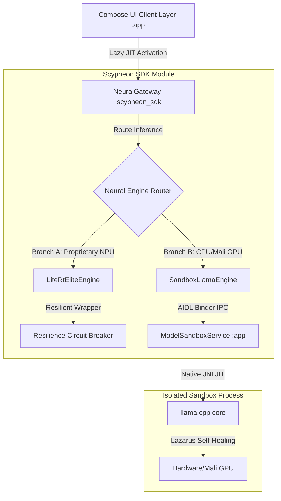

# SCYPHEON PRIVATE: Offline-Native Hybrid Architecture Manual
*Version: 1.5.4 (Resilience & Immersive Voice Integration)*
*Status: Developer Blueprint & Code Map*

---

## 1. Executive Summary & Design Philosophy
Scypheon is designed as a secure, offline-native, resilient humanitarian AI system optimized for extreme conditions (disaster zones, network outages, high-stress Mali GPU environments). The platform enforces **Zero-Trust Local Execution** by hosting all models directly on the client, ensuring complete privacy, zero external dependencies, and absolute data control in regions without cellular mesh connectivity.

---

## 2. High-Level Architectural Blueprints



### 2.1 AIDL Process Sandboxing
To protect the main application process from fatal memory faults, out-of-memory (OOM) triggers, or segment violations in the native layer (highly common on diverse Mali GPU drivers), GGUF-based inference runs inside an isolated sandbox process (`:app:ModelSandboxService`) mediated by a secure AIDL communication interface (`IScypheonSandbox`).
* **Symmetric Memory Allocations:** The JNI interface is aligned on symmetric batch sizes (128) to prevent OOM/SIGABRT crashes.
* **Lazarus Self-Healing:** The SDK monitors the Binder's connection lifecycle. If the sandbox process dies due to a driver fault, the SDK detects the death, clears memory structures, and re-binds instantly.

### 2.2 Dual-Branch Gateway Routing & Resilience
The authorative inference dispatcher (`NeuralGateway`) dynamically routes user prompts to the most competent active engine:
1. **Branch A (Proprietary NPU/GPU Acceleration):** `LiteRtEliteEngine` leverages modern JNI bindings for local Gemma 3/4 inference. It is protected by `ResilienceCircuitBreaker`.
2. **Branch B (Universal CPU/GPU Fallback):** `SandboxLlamaEngine` is the highly versatile GGUF executor running within the sandboxed service.
* **Resilience Circuit Breakers:** Both branches execute within the `ResilienceCircuitBreaker` framework. If an engine fails, the circuit opens, and subsequent requests instantly route to the alternate fallback engine.

### 2.3 Standby Lazy Loading (Lazy JIT Initialization)
To ensure instant start-up, the engine resolves local model paths asynchronously off the main thread at launch, placing them in a `(STANDBY)` state. The heavy JIT initialization (RAM allocation, library mapping) is deferred until the user:
* Sends their first text message, or
* Launches the Live Voice session.
Messages sent during dynamic model booting are queued inside a non-dropping Coroutine `Channel` and drained sequentially as soon as the engine state transitions to `Success`.

---

## 3. Project Directory & Folder Map

This hybrid directory map bridges the physical folder structures with their respective architectural responsibilities:

### 📂 Root Folder: `D:\AuraLink\`
* **`scypheon_private/`**: The core repository containing the application module and main UI layer.
  * **`app/src/main/java/com/scypheon/app/`**
    * 📂 **`ui/`**: ViewModels, Main/Live activity controllers, and Screens.
      * [MainActivity.kt](file:///D:/AuraLink/scypheon_private/app/src/main/java/com/scypheon/app/ui/MainActivity.kt) — Orchestrates activity states.
      * [MainViewModel.kt](file:///D:/AuraLink/scypheon_private/app/src/main/java/com/scypheon/app/ui/MainViewModel.kt) — Binds UI state, triggers JIT initialization, and processes manual orb clicks.
    * 📂 **`ui/screens/`**: Frosted Jetpack Compose layouts.
      * [MainChatScreen.kt](file:///D:/AuraLink/scypheon_private/app/src/main/java/com/scypheon/app/ui/screens/MainChatScreen.kt) — Classic chat screen containing the premium glassmorphic welcome badge.
      * [LiveModeScreen.kt](file:///D:/AuraLink/scypheon_private/app/src/main/java/com/scypheon/app/ui/screens/LiveModeScreen.kt) — Premium deep obsidian dark voice screen with an interactive morphing watercolor orb.
    * 📂 **`data/`**: Configuration models, repositories, and local system status tracking.
      * [ScypheonRepository.kt](file:///D:/AuraLink/scypheon_private/app/src/main/java/com/scypheon/app/data/repository/ScypheonRepository.kt) — High-level grounding data repository.
    * 📂 **`di/`**: Dagger Hilt injection modules.
      * [SdkModule.kt](file:///D:/AuraLink/scypheon_private/app/src/main/java/com/scypheon/app/di/SdkModule.kt) — Configures engine scopes.

* **`scypheon_sdk/`**: The underlying SDK module providing offline-native logic and security infrastructure.
  * **`src/main/java/com/scypheon/sdk/core/`**
    * 📂 **`gateway/`**: The primary inference dispatch layer.
      * [NeuralGateway.kt](file:///D:/AuraLink/scypheon_sdk/src/main/java/com/scypheon/sdk/core/gateway/NeuralGateway.kt) — Determines dual-branch routing (LiteRT vs Llama).
    * 📂 **`engine/`**: The AI executors.
      * [SandboxLlamaEngine.kt](file:///D:/AuraLink/scypheon_sdk/src/main/java/com/scypheon/sdk/core/engine/SandboxLlamaEngine.kt) — Heavy, sandbox-isolated GGUF interpreter.
      * [LiteRtEliteEngine.kt](file:///D:/AuraLink/scypheon_sdk/src/main/java/com/scypheon/sdk/core/engine/LiteRtEliteEngine.kt) — Proprietary, high-performance local Gemma engine.
    * 📂 **`resilience/`**: Structural safety circuit breakers.
      * [DefaultResilienceCircuitBreaker.kt](file:///D:/AuraLink/scypheon_sdk/src/main/java/com/scypheon/sdk/core/resilience/DefaultResilienceCircuitBreaker.kt) — Monitors engine failures and isolates faulty code blocks.
    * 📂 **`memory/`**: Secure database storage, local summarizers, and local vector retrieval.
      * [DualMemoryManager.kt](file:///D:/AuraLink/scypheon_sdk/src/main/java/com/scypheon/sdk/core/memory/DualMemoryManager.kt) — Grounding vector database coordinator.
    * 📂 **`utils/`**: Telemetry and utility libraries.
      * [SolarisTelemetry.kt](file:///D:/AuraLink/scypheon_sdk/src/main/java/com/scypheon/sdk/core/utils/SolarisTelemetry.kt) — High-speed async NDJSON batched flusher.

* **`llama/`**: JNI and native C++ wrappers built for compiling the GGUF model loader on Android platform targets.

* **`docs/`**: Production data resources and architectural guidelines.
  * [SCYPHEON_ARCHITECTURE.md](file:///D:/AuraLink/docs/SCYPHEON_ARCHITECTURE.md) — This document.
  * [DATA_SOURCES.md](file:///D:/AuraLink/docs/DATA_SOURCES.md) — Provenance of clinical seeder data.

---

## 4. Manual Voice Orb State Machine
The custom real-time speech interaction utilizes a **Manual Push-to-Talk (PTT)** model to guarantee absolute reliability under poor audio conditions. It conforms to the following state diagram:

```
          ┌────────────────────────────────────────┐
          │                  Idle                  │
          └───────────────────┬────────────────────┘
                              │ Tap Orb (Start Session)
                              ▼
          ┌────────────────────────────────────────┐
          │               Listening                │
          └───────────────────┬────────────────────┘
                              │ Tap Orb (Record)
                              ▼
          ┌────────────────────────────────────────┐
          │             User Speaking              │
          └───────────────────┬────────────────────┘
                              │ Tap Orb (Manual Send)
                              ▼
          ┌────────────────────────────────────────┐
          │               Processing               │
          └───────────────────┬────────────────────┘
                              │ Prompt Completed
                              ▼
          ┌────────────────────────────────────────┐
          │              AI Speaking               │
          └────────────────────────────────────────┘
```
* **Interruption Rule:** Tapping the Orb during the `AI Speaking` or `Processing` states instantly cuts the audio feed, halts the generator, and returns to `Listening` standby.
